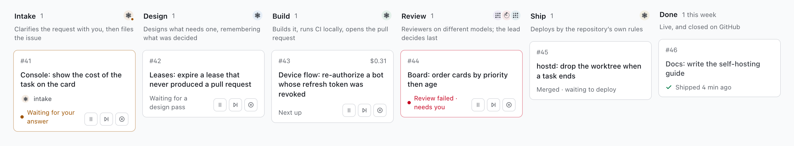
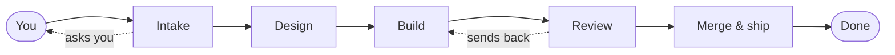
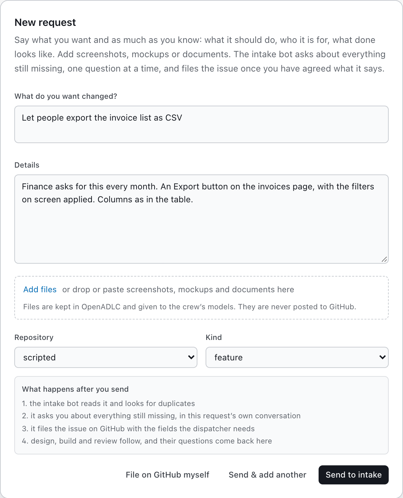
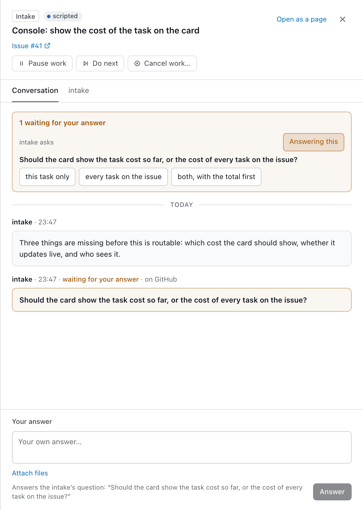

<h1 align="center">OpenADLC</h1>

<p align="center">
  <b>A crew of AI agents that takes a request to a reviewed, merged, deployed change — on your GitHub, on your machines.</b>
</p>

<p align="center">OpenADLC runs the agentic development life cycle (ADLC) for your repositories.</p>

<p align="center">
  <a href="LICENSE"></a>
  <a href="https://github.com/620legal/OpenADLC/actions/workflows/ci.yml"></a>
  
  
</p>

<p align="center">
  <a href="#quick-start">Quick start</a> ·
  <a href="#how-it-works">How it works</a> ·
  <a href="#the-crew">The crew</a> ·
  <a href="#documentation">Docs</a>
</p>

<p align="center">
  
</p>

You describe what you want: a sentence, a page of detail, screenshots. Intake
asks you what is missing, a builder implements it and runs CI, reviewers on
different models check it, and it merges and ships by your repository's rules.
You answer questions; you don't babysit.

Self-hosted and single-tenant: your GitHub, your model accounts, on a laptop or
in your cloud. GitHub stays the system of record.

## How it works



| Stage | What happens |
|---|---|
| **Intake** | Asks you, in the request's own conversation, until it is clear, then files the issue |
| **Design** | Only when an issue needs one; the one stage that remembers earlier decisions |
| **Build** | Implements it, runs `make ci` until green, opens the pull request |
| **Review** | Reviewers on different models post their verdicts; the lead reads them all and approves or sends it back |
| **Merge & ship** | GitHub CI runs after the lead approves; OpenADLC merges as its GitHub App, one pull request at a time, and your repository's rules deploy |

Any stage can send work back one step, with a reason. When an agent needs a
decision it asks you on the card, and the work waits for your answer.

<table>
  <tr>
    <td width="50%"></td>
    <td width="50%"></td>
  </tr>
  <tr>
    <td align="center"><sub>Ask for anything, with files attached</sub></td>
    <td align="center"><sub>Each piece of work has its own conversation</sub></td>
  </tr>
</table>

## Quick start

On a Mac, or Linux (Ubuntu, Debian, Fedora; on Windows, inside WSL 2), one
command installs it and starts it:

```bash
curl -fsSL https://raw.githubusercontent.com/620legal/OpenADLC/main/infra/local/install.sh | bash
```

It says what the machine is missing and asks before installing it: Node 22+,
pnpm, git, tmux, Docker ([OrbStack](https://orbstack.dev) on a Mac), cloudflared
(so GitHub's webhooks reach a laptop), and on Linux the compiler node-pty needs.
Then it clones this repository to `~/OpenADLC`, builds it and the bot image,
writes the install to `~/.fleetadlc`, starts it and opens the console. Run it
again to bring the checkout up to date; `--help` lists its options.

<details>
<summary>Or step by step</summary>

You need **Node 22+**, **pnpm 10**, **git**, **tmux** and **Docker** (Docker
Desktop, [OrbStack](https://orbstack.dev), or Docker on Linux). On Linux,
`pnpm install` also needs **python3**, **make** and **g++** (`build-essential`
on Debian and Ubuntu): node-pty, the terminal take-over's module, is compiled
there. On a laptop you also need **cloudflared** (`brew install cloudflared` on
a Mac, or your distribution's package), which the console uses so GitHub's
webhooks can reach this machine; a deployed install uses its own public URL
instead.

```bash
git clone https://github.com/620legal/OpenADLC.git && cd OpenADLC
pnpm install && pnpm build
infra/local/build-bot-image.sh           # the image each task's container runs
pnpm fleetadlc init --driver docker      # the install lives in ~/.fleetadlc
pnpm fleetadlc up                        # then open the console link it prints
```

</details>

The link signs your browser in to the console, which listens on 127.0.0.1 and
serves nothing to a browser that has not signed in. It works for an hour;
`pnpm fleetadlc console-link` prints another.

The console walks you through the rest and checks each step as you go: a
GitHub App, the crew's GitHub accounts (two at least: one builds, one
reviews; mind [GitHub's limit on free machine accounts](docs/self-hosting.md#2-create-the-github-accounts)),
a model account (Anthropic, OpenAI or xAI), and a repository. Then press
**New request**.

Use an API key, or a business or team plan, for the model account. A personal
subscription can be connected, but it is the subscriber's consumer account:
whether it may drive an automated crew is for the provider's current terms to
say, not OpenADLC, and a provider may suspend an account it finds used against
them. See [Subscriptions](docs/self-hosting.md#subscriptions).

`pnpm fleetadlc doctor` says what would break; `pnpm fleetadlc down` stops it.

**In the cloud:** one command builds the images on Cloud Build and applies
[`infra/gcp`](infra/gcp) to a Google Cloud project of its own: Cloud Run, Cloud
SQL, a host VM with an egress allowlist, and IAP in front of the console. Open
Cloud Shell with this repository in it,

[](https://shell.cloud.google.com/cloudshell/editor?cloudshell_git_repo=https://github.com/620legal/OpenADLC&cloudshell_git_branch=main&cloudshell_print=infra/gcp/cloud-shell.txt&shellonly=true)

and run `infra/gcp/install.sh --project <new-project-id>`, or paste this into
any terminal with the [gcloud CLI](https://cloud.google.com/sdk/docs/install):

```bash
curl -fsSL https://raw.githubusercontent.com/620legal/OpenADLC/main/infra/gcp/install.sh | bash -s -- --project my-openadlc
```

It asks before it creates the project (`--billing-account`), builds or
applies, and asks you only for the console's domain. Then point one DNS record
at the address it prints, and the console's walkthrough does the rest. See
[Installing on a cloud](docs/self-hosting.md#installing-on-a-cloud).

## The crew

Each seat is a role with its own model; change them on the Crew page
([`config/bots.yaml`](config/bots.yaml) is only the fresh install's default).

| Seat | Does | Default model |
|---|---|---|
| intake | Clarifies the request, files the issue | Claude Sonnet |
| system-engineer | Designs | Claude Opus |
| builder | Implements, runs CI, opens the PR | Claude Opus |
| lead-reviewer | Reviews last and decides | OpenAI Codex |
| second-reviewer | A second opinion, on another provider | xAI Grok |
| security-reviewer | Secrets, auth, injection, dependencies | OpenAI Codex |
| sre · qa | Reverts after a red smoke, and reviews workflow, runbook and infrastructure changes · journeys and smoke tests | Claude Opus |

Each seat follows its model family's newest release. A seat whose provider you
have no account for is put on one you do in the Crew step; nothing switches it
to another provider later.

## Safety

What follows is how OpenADLC is designed to behave, not a guarantee. Where
something has not yet been seen working, [the unverified log](docs/unverified.md)
says so.

- **You choose how far it goes on its own.** Per repository, asked when you
  set it up: production ships automatically after testing (a soak, the smoke,
  and an automatic rollback), which is the default, or after a person you
  name approves each deploy. When a person must approve, OpenADLC never
  leaves production's reviewer list empty. Whichever you choose, the rest of
  this list applies. The deploy
  path (deploy, smoke, promote, revert) is new and has not yet run against a
  live environment: what it relies on GitHub to do is listed, as U37 to U43, under
  [Open in the unverified log](docs/unverified.md#open).
- **Merges follow the reviews.** OpenADLC merges, as its GitHub App, only
  after the lead reviewer approves the change (that commit, or an earlier one
  with the same diff against the base) and GitHub Actions CI passes on the
  commit that lands. OpenADLC's `gh` refuses a bot's merge, and where GitHub
  enforces rulesets (public repositories, or paid plans) the branch's rules
  require those approvals. On a private repository whose plan refuses
  rulesets, a bot's token could still merge through GitHub's API: such a merge
  is detected, flagged and its deploy held, not prevented
  ([security model](docs/security.md#the-platform)).
- **Agents don't approve a deploy.** Production goes out when your GitHub
  environment releases it: a required reviewer, or a soak timer if you chose
  automatic. Where GitHub's plan cannot hold a reviewer on production (a
  private repository on Free, Pro or Team), OpenADLC holds each promote in
  Needs you until a person releases it, or switches the repository to
  automatic delivery.
- **Spend is capped** per task and per month (Settings → Spending limits;
  [`config/costs.yaml`](config/costs.yaml) seeds them on the first start); a
  cap stops work and asks.
- **Each task runs in its own container** (the `docker` driver, which a new
  install takes when Docker and the bot image are there). Its GitHub token
  expires in hours; the model account's key or sign-in is long-lived. On the
  Google Cloud install ([`infra/gcp`](infra/gcp)) a task reaches only GitHub,
  package registries and its model, through an egress proxy and a host
  firewall; a laptop, compose or self-managed host does not restrict where it
  connects. See [egress](docs/security.md#egress).
- **Prompt injection is assumed.** Agents act only for people with access to
  the repository and its crew, and read only what those people wrote. See the
  [security model](docs/security.md).
- **You are responsible for what your crew does.** OpenADLC runs on your
  infrastructure, your GitHub and your model accounts. A change is not correct
  or safe because the crew wrote, reviewed or shipped it; your reviews, checks
  and approvers decide that. See
  [what OpenADLC does not do](docs/security.md#what-openadlc-does-not-do).

## Documentation

[Architecture](docs/architecture.md) ·
[Self-hosting](docs/self-hosting.md) ·
[Configuration](docs/configuration.md) ·
[CLI](docs/cli.md) ·
[Security](docs/security.md) ·
[Troubleshooting](docs/troubleshooting.md) ·
[Developing](docs/development.md) ·
[Extending](docs/extending.md)

OpenADLC is early, and in use: 620 Legal builds its software with it, this
repository included. Contributions are welcome — see
[CONTRIBUTING](.github/CONTRIBUTING.md); report security issues privately via
[SECURITY](.github/SECURITY.md).

Apache-2.0 — see [LICENSE](LICENSE), [NOTICE](NOTICE) and the
[trademark policy](docs/trademarks.md). The files OpenADLC adds to a managed
repository ([`crew/templates/`](crew/templates)) are also offered under 0BSD,
so they carry no attribution duty into your code; see
[crew/templates/LICENSE](crew/templates/LICENSE).

OpenADLC is provided "as is", without warranty of any kind, as the
[licence](LICENSE) says. Nothing in this repository is legal advice. That its
publisher is named 620 Legal does not mean OpenADLC, or anything it builds,
has been reviewed for compliance with any law or any third party's terms.
