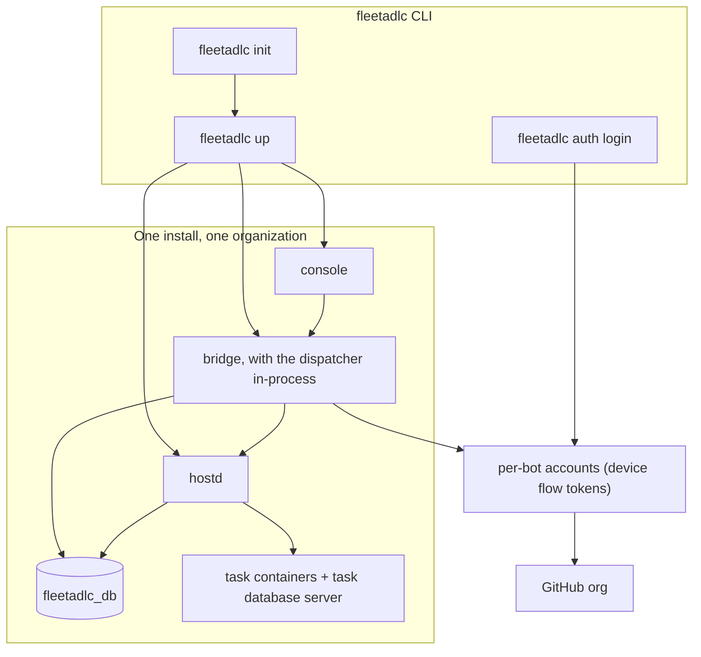

# OpenADLC platform plan

The design this repository implements, the decisions behind it, and what is built
so far. This document changes by pull request; the rules in it are what reviewers
hold changes against.

## 1. What OpenADLC is

A crew of bots that takes a request from a person — a sentence, a page of detail,
screenshots or documents — clarifies it with them, turns it into an issue
that can be built from, designs, implements, reviews, merges and deploys the
change, and asks the person for a decision only when one is needed.

GitHub holds every artifact: issues, comments, branches, pull requests, reviews,
checks, environments. OpenADLC holds only what GitHub cannot — the bots' computers,
their leases, their sessions, the cost ledger, and the console that shows all of
it in one place.

## 2. Principles

1. **GitHub is the system of record.** If it is not on the issue or the pull
   request, it did not happen. The console is a view.
2. **Handoffs are labels; bots start themselves.** A stage is a label; the bot
   that staffs the stage watches for it and begins. Nobody assigns a bot.
3. **One task, one computer; one seat, one identity.** A task runs in a
   computer made for it and removed after it; a seat is the GitHub account
   and the chat its tasks share, never a machine. Skills are installed, never
   mandatory; a task with only a shell is still a working task.
4. **Nothing is guessed.** A gate holds one bot's work and is the only thing that
   demands a person.
5. **Observation is free; intervention is always available.** The process list is
   the truth about a container. Attaching or detaching never kills anything.
6. **Merges follow the reviews; deploys follow GitHub's rules.** No bot merges
   or approves through OpenADLC, and where GitHub enforces rulesets nothing
   else lets it; on a private repository whose plan refuses rulesets a crew
   merge made around them is detected and its deploy held, not prevented. The
   merge line merges as the app once `mergeDecision` holds —
   the lead's approval of that head, GitHub Actions' `ci` on it, and the
   approval of each person AGENTS.md (on the base branch) names under Human
   review for the paths it touches — and a deploy goes out when the repository's
   environment releases it — a person, or a soak timer when it ships
   automatically. That much is a platform invariant, not a setting. How far a
   repository goes on its own is its own `.github/fleetadlc.yml`.
7. **Every rule is a check.** A rule an agent must remember will be forgotten; a
   rule the system enforces will hold.
8. **Bounded spend.** Every task and every month has a ceiling, and hitting one
   stops work rather than continuing silently.

## 3. Distribution

OpenADLC is **self-hosted and single-tenant per install**. One install serves one
GitHub organization or personal account (and, with a public app, repositories
under other accounts). There is no hosted multi-tenant service, and the platform
does not replace GitHub Actions for CI, GitHub Environments for deploy approvals,
or your own hosting for the products it builds.

The install target is one command on this machine, and three for Google Cloud:

```bash
fleetadlc up              # local: this machine; the crew needs GitHub accounts and model credentials
fleetadlc cloud configure # Google Cloud: then fleetadlc cloud plan, then fleetadlc cloud apply
```

Local Docker Compose and a local-process driver work today. A Google Cloud
module (`infra/gcp`, with the installer interface multi-provider from the start)
has been applied once, on 2026-09-26, with the open items listed in
[`unverified.md`](unverified.md); AWS and Azure come after the platform is
complete.

## 4. GitHub identity and authorization

**Real GitHub user accounts for the bots**, one per seat or one per group of
seats, connected with the OAuth **device flow**. No personal access tokens, and
no one identity acting as the whole crew: the seats that build and the seats
that review are never on one account.

| Piece | Choice |
|---|---|
| Identity | A real GitHub user account per seat, or one shared by a group of seats (a crew account, a reviewer account), invited to each repository as a collaborator with the widest role its seats need. That collaborator role is the account's least privilege; no organization or team is needed. |
| Name | A bot goes by its account's handle, lowercased, and its container, work folder, secrets and sessions are kept under it. Until an account connects it is named after its seat — `builder`, `lead-reviewer` — which `config/bots.yaml` lists and `fleetadlc up` finds it by. The configuration names no account, so nothing is reserved in advance. |
| Client | One **OpenADLC GitHub App** per install, with device flow enabled and expiring user tokens on. It is the bots' OAuth client, and acts as itself for the repository's administration and the merge line (invitations, rules, merges, the review gate); reviews and comments are never posted as the app, and no bot can act as it. Its private key mints installation tokens that can write to and administer every repository the app is installed on, so it is the install's widest credential. |
| Authorization | `fleetadlc auth login --bot lead-reviewer` calls `POST https://github.com/login/device/code`, prints the user code, and polls `POST https://github.com/login/oauth/access_token` with `grant_type=urn:ietf:params:oauth:grant-type:device_code` until a person approves as that account. |
| Credentials | The result is a user token (8 hours) and a refresh token (6 months). Only the refresh token is stored. GitHub rotates it on every use, so the new one replaces the old. The bridge is the install's only token service and the only component that refreshes: two refreshing one token would sign each other out. hostd asks it for a task's token (with at least five hours left) and injects it into the task's session environment. |
| Attribution | Because the token is user-to-server, every comment, review, label and push is attributed to the bot's own account, so CODEOWNERS, required reviews and the review gate's author check all work against real logins. |
| Signing | After device auth, OpenADLC generates an SSH signing key per bot and uploads the public half to that account. The private half stays in the secret store and is loaded into a per-task `ssh-agent`, so signed-commit rules hold. |
| Re-auth | If a refresh token is revoked, `fleetadlc doctor` says so and `fleetadlc auth login --bot <name>` repeats the flow. Nothing expires on a ninety-day treadmill. |

## 5. Architecture



| Component | Purpose |
|---|---|
| `hostd` | The runner: gives each task a computer of its own and takes it back when the task ends, clones the task's repository into it, mints session environments, reports sessions and processes every ten seconds, enforces the per-task cost cap, issues terminal attach tokens ([ADR 0003](adr/0003-per-task-containers.md)) |
| `bridge` | The one event loop: GitHub webhooks, the console API, the GitHub automation (stage labels, reviewer requests, the `review:human:<login>` labels, the `review-gate` check run), gates, and task starts and resumptions |
| `dispatcher` | A library the bridge runs shortly after anything changes that could let work start, and every five minutes: leases routable issues to builders with room — the repository's concurrency, each seat's tasks at once, the hosts' capacity — without path overlap, expires stale leases, stops leasing at the monthly cap |
| `console` | Board, threads, gates, crew, Computer tab, costs, repository settings. Holds no database of its own |
| `fleetadlc_db` | Bots, repositories and stage modes, issues, leases, tasks, sessions, threads, gates, ledger, budgets, audit, events |

### Why the automation lives in the bridge

Actions taken with a workflow's `GITHUB_TOKEN` do not trigger other workflows, so
a chain of workflows (label, then request reviewers, then compute a gate) breaks
silently at its first link. The bridge receives every webhook whatever the actor,
acts as one account, and re-derives the right answer from GitHub's current state
on every relevant event — so a duplicate delivery is harmless and a missed one is
repaired by the next event or the reconciliation that runs every 15 minutes.

## 6. The pipeline

Stages are labels, applied by the bots and the bridge:

| Label | Column | Meaning |
|---|---|---|
| `adlc:intake` | Intake | An issue exists but is not yet routable |
| `adlc:spec` | Design | A design comment is owed before implementation |
| `adlc:build` | Build | Routable; the dispatcher may lease it |
| `adlc:review` | Review | A pull request exists and reviews are owed |
| `adlc:merged` | Ship | Merged; deploying to testing, promote pending, as the repository's `.github/fleetadlc.yml` says. `testing: none` ships by merging, straight to Done |
| `adlc:done` | Done | Live |

**Stage modes** per repository: `autonomous` (act unless a stop rule fires),
`untouched` for intake and spec only (no bot staffs it; refused for the later
stages, whose bots are stopped with Pause work), and `conditional` for spec (run
when a spec-required label is present). `assist` (prepare, then ask before the stage's
terminal act) was one, and nothing enforced it: it is read as `autonomous`.
Production is held by the repository's `production` environment, as its
delivery rules say — required reviewers or a soak — not by a stage mode.

**Routability.** An issue is routable when it carries `adlc:build` and
`start:now`, has no `needs-human`, `needs-triage`, do: label but `do:ai`
(`do:human`, `do:product`, `do:legal`) or `fleetadlc:ignore`, declares the paths it expects to touch, and everything under its
`### Dependencies` has shipped. It must also say enough to be worked on
(`missingForRouting`, `packages/shared/src/readiness.ts`): a `priority:` label,
an `area:` label, exactly one `do:` label, and the Outcome, Acceptance criteria,
Expected paths and Verification sections, every line of Expected paths a path.
An issue missing any of them is sent to triage, or, when only a path line is
unreadable, back to the stage that wrote it. One labelled `fleetadlc:paused` is
passed over, and `fleetadlc:next` goes ahead of priority order. The dispatcher
leases the highest-priority routable issue whose declared paths no change in
flight holds, by the repository's path policy (`paths:` in
`.github/fleetadlc.yml`): an overlap on a shared path never holds it, an
exclusive path holds it until the other change merges, and any other overlap
holds it only while the other issue is being built, not while its pull request
is in review. Work in flight is the work itself, rather than whatever a lease
left behind claims.

`fleetadlc:ignore` is a person telling the crew to leave an issue alone. While it is
there the crew staffs no stage, hands on no stage, unblocks nothing and runs no
failed task again: a task already running finishes without moving the stage, and
a build that opens its pull request leaves the issue in build, though the pull
request is reviewed. Intake and the stage handoffs check the label GitHub has at
the time, not only the stored one, so an issue labelled in a second call after
it was opened is not staffed either. A question a running task asks is kept in
the bot's thread, and nothing is posted or labelled on the issue, not when
it is asked and not when it is answered or stopped. Nothing moves its stage:
not a handoff, not a person on the board, not the merge of its pull request,
nor the reconciler standing in for that merge's delivery (`moveStage` refuses
it, reading the labels GitHub has, and fails when it cannot read them). The
console is for the work the crew does, so the issue and its pull request are
not on it: not on the board or in the merge line there, not in Needs you,
the item view, a seat's queue or history on the Crew page or Insights, and in
no count those show (`ignoredSubjects` in `apps/bridge/src/work.ts` is the
one rule they read). What was spent on it stays in the cost totals. What is
the seat's rather than the work's stays too: a bot's own thread, and what a
seat is doing now on its Crew card, which is where a task that was running
when the label went on is answered or stopped. A person's reply on the issue
answers no gate, and the gate's thread says so. Taking the label off makes it
ordinary again: the card comes back where its stage label says, with whatever
is still open on it.

**Concurrency.** Concurrency is a number. A task runs in a computer of its own,
so how many run at once is a count, not a roster: a repository builds up to its
`concurrency` at once, paused builds included; a seat runs up to its tasks at
once (`bots.max_tasks`, 1 to 16, from Crew), each task in its own computer and
all as the seat's one GitHub account; and a host runs up to its
`capacity_tasks`. One issue in flight per repository is still the default.

The collision guarantee is the lease and the overlap check: a lease claims an
issue's declared paths, and the dispatcher leases nothing whose paths another
change in flight holds by the path policy above (`paths:` in
`.github/fleetadlc.yml`). Two builds never edit one ordinary file at once; a
change in review, or two on a shared path, may, and the merge line's conflict
round settles what clashes. Two tasks in two computers never stopped two builds
from editing one file; the check did. The dispatcher fills the owner's room first, then each other
builder's in seat order; a paused build counts against its repository always,
and against its seat only while its computer is kept. If the configured
concurrency outruns what the builders can run between them it says so —
"combined maxTasks is M" — rather than quietly running fewer. A second builder
seat is how a repository gets a second account, not a second computer.

**Movement.** A stage hands on when its own work ends; the bridge moves the
label. Every stage can also send its work back to the stage before it, with a
reason: design to intake, build to design (or to intake when there was no
design pass), review to build, ship to build. Where it goes is worked out from
the issue's own history (`previousStage`), passing over a stage nobody
staffs; when nothing on the way back is staffed, a person takes it. A bot asks
for a send-back from its own session and the bridge decides, says it on the
issue, and moves the card; a bot that moves a stage label itself is put back.
Ship to build is the bridge's own: a red smoke on testing, or a failed
production deploy, sends the change back with the run as its reason.
Review to build is the review loop's round, held to `maxRounds`; every other
edge is held to `sendBack.maxPerEdge` and `sendBack.maxPerIssue`
(`config/review.yaml`), and past them the work stays where it is and a person
decides. A person can move any card anywhere from the console — back only with
a reason — or by its label on GitHub, and every move is recorded and audited.

## 7. Gates

A gate on an issue or pull request is written to GitHub first — the comment is
the durable record — then mirrored into the thread the console shows, and it
pauses the task. A gate on a console request that has no issue yet, or on an
issue labelled `fleetadlc:ignore`, is kept in the console thread only. The issue gets
`needs-human`, which keeps the dispatcher from leasing it again. Answering (in the
console, or by replying to the comment on GitHub) removes the label, records who
answered, and resumes the task with a fresh context off the branch head.

## 8. Cost control

Every engine invocation is written to the ledger **before its output is acted
on**, so a cap trips between invocations rather than after a runaway. Before each
invocation the skill asks for headroom; when the task's total would exceed its cap
the skill stops at a safe point and opens a gate offering to continue, hand over,
or abandon. The dispatcher reads month-to-date spend every run: at the warning
threshold it warns, at the monthly cap it stops leasing new work
(`onCap.stopLeasing`), and running tasks finish.

Defaults: **$15 per task**, **$1,500 per month**, warning at 90 percent. Both live
in [`config/costs.yaml`](../config/costs.yaml).

## 9. Reviews

Reviewers are seats listed in `config/review.yaml`, each with a lens and a
trigger. The second reviewer reviews on a different model so two reviewers do
not share a blind spot. The security reviewer joins on security labels,
security-sensitive paths, dependency changes and a sample of everything else.
The SRE joins when workflows or runbooks change. Each reviews independently,
without CI, and posts its review as a comment with its verdict in its marker.

One seat is the lead, requested on every pull request and the code owner GitHub
itself requires. It reviews last: once every other seat asked has posted on
this diff, it reads them all and the diff, and decides — approve, or one
request for changes that sends the work back to build. A seat may be marked
`blocking`, when its approval is needed too. After three rounds that have not
converged the loop stops and asks a person.

`review-gate` is a check run the bridge publishes as the app, with a commit
status of the same name beside it: pending while the pull request is a draft,
while a seat asked has not posted on this diff, while the lead has not, until
the lead and every blocking seat approved, until every person AGENTS.md names
for the paths it touches approved, or while `needs-human` is on; success
otherwise. Overriding a reviewer is a person dismissing the
review with a reason and approving, and a bot dismissing a review is treated as
an incident. The rulesets' one bypass actor is OpenADLC's own GitHub App
(`bypassForApp`, `packages/github/src/rules.ts`), in `always` mode, so it can
write CODEOWNERS to a branch it protects. The merge line merges as the app, so
`mergeDecision`, not the ruleset, is what holds its merges, and the app's
private key is what guards `main`.

## 10. Security posture

- **The container.** On an `infra/gcp` install a task's container can reach
  GitHub, package registries, its engine's API and nothing else; on any other
  install it can reach any host ([security.md](security.md#egress)). On every
  docker install it cannot reach another task's container, which the install's
  task network keeps out of reach. It holds no long-lived secrets on
  disk: hostd injects a task's credentials into the tmux session environment, and
  the environment dies with the session, as the container does with the task. It
  has no production credentials.
- **The account.** Each GitHub account holds the collaborator role its seats
  need. Reviewer accounts have write, because approvals only count with it, and
  nothing on GitHub keeps them off work branches: OpenADLC's `git` refuses a
  reviewer's push, and `review-gate` asks again when the diff changes. An
  automation account of its own gets triage on an organization's repository;
  on the shared crew account it has write, and never authors commits.
- **Prompt injection.** Bots read untrusted text constantly. The posture: the
  container has nothing production to touch and, on an `infra/gcp` install,
  nothing to exfiltrate to; every
  change but a revert goes through two reviewers on different engines; the
  checklist for injected intent runs where the security reviewer is asked (its
  labels and paths, a change to CI, and a sample of the rest), not on every
  change; and the paths a task's lease declared hold its write scope only where
  the repository's CI runs the scope check, as OpenADLC's own does. A session
  cannot put on or take off the labels that choose its review (`revert`,
  `deps`, `scope:cross-cutting`).
- **Deploys.** The bridge dispatches each deploy workflow as the app, by the
  repository's rules, and approves nothing: the `production` environment's
  required reviewers or wait timer hold the promote. A crew account among those
  reviewers is a blocking health check.
- **The console.** Identity comes from the reverse proxy (IAP or equivalent) in a
  cloud install and from a header locally. Every attach, kill, restart, gate answer
  and settings change is written to `audit` with that identity.

See [security.md](security.md) for the full model.

## 11. Build sequence

| Phase | Deliverable | State |
|---|---|---|
| P0 | Monorepo, `fleetadlc_db`, engine adapters, hostd with both drivers, bridge, dispatcher, console, CLI, skills | **built** |
| P1 | Real GitHub loop: webhooks, device-flow tokens, issue → lease → pull request | **mechanism built and proven against a live repository**; needs a crew of real accounts on a real organization |
| P2 | Review lenses on three engines, deploy and revert, caps exercised under load | caps and the budget stop are **built and tested** (`tests/pipeline.mjs`); the merge line is **built and tested** (`apps/bridge/src/merge-line.test.ts`); the deploy path is **built and untried** — four workflows, two environments and the bridge's handling of `deployment_status`, of which **no deployment has ever been created**, so every claim about what GitHub does with it is a row in [`unverified.md`](unverified.md); a red smoke on testing reverts the change and sends it back to build, and a failed deploy files an issue instead |
| P3 | Console: board, threads, gates, intake, crew, costs, repository settings | **built**; defects from real use are tracked as issues |
| P4 | Terminal gateway in the browser, session take-over, full audit | **built and tested**: a WebSocket to a PTY, xterm.js, single-use attach tokens, audit on attach, detach, kill and restart |
| P5 | Cloud module, egress allowlist, reconciliation, `concurrency: 2`, two weeks of self-driving PRs, then public | reconciliation and concurrency are **built and tested** (`tests/concurrency.mjs`, `apps/hostd/src/observer.test.ts`); the cloud module is **written, structurally checked** (`terraform validate`, `tests/cloud-module.test.ts`) **and applied once**, on 2026-09-26: the firewall, the egress allowlist and the restricted ingress were seen working, and what is still unseen — IAP refusing a stranger, the stream through the load balancer, mTLS to hostd — is a row in [`docs/unverified.md`](unverified.md); OpenADLC was published as open source before the two-week window, which is still to run and needs a live organization |

### What is proven, and how

| Claim | Evidence |
|---|---|
| A routable issue becomes a running task with a lease, a worktree, a branch, a session and a ledger entry | `tests/pipeline.mjs` |
| An issue in a staffed stage is picked up and handed on when that stage's work ends | `tests/pipeline.mjs`, `apps/bridge/src/stage-handoff.test.ts` |
| A task's session carries only what hostd minted for it, so a bot never inherits the platform's own database | `apps/hostd/src/drivers/base-env.test.ts` |
| Pull requests land one at a time, each brought up to date and re-tested first, without GitHub's merge queue | `apps/bridge/src/merge-line.test.ts`, `tests/pipeline.mjs` |
| A reviewer or automation account cannot land code, and a diff cannot quietly grow past what its issue declared | `packages/shared/src/checks.test.ts`, the review gate's author check (`apps/bridge/src/automation.test.ts`, `apps/bridge/src/webhooks.test.ts`), and `.github/scripts/scope-check.mjs`, which `.github/workflows/ci.yml` runs |
| A task is briefed before it starts: its role playbook, the repository's `AGENTS.md`, and the issue or pull request it was opened for | `tests/pipeline.mjs`, `apps/bridge/src/context.test.ts` |
| A task that reaches its cap stops and asks; a month at its cap stops new leasing | `tests/pipeline.mjs` |
| The platform can file, label, assign, gate and status a real GitHub issue | `tests/github-live.mjs`, against a live repository |
| A task can clone with a brokered token, branch, sign, push and open a pull request | `tests/github-live-pr.mjs`, against a live repository |
| Take-over works: attach, type, read output, detach, session survives | `tests/terminal.mjs` |
| Interrupting a task leaves the branch and the mirror alone and returns the issue | `tests/kill-and-restart.mjs` |
| `concurrency: 2` runs two builds at once, on one seat with two tasks at once or on two seats, each in a computer of its own | `tests/concurrency.mjs` |
| The onboarding walkthrough tells the truth about accounts, access and the app, and does not invent GitHub answers when it cannot ask | `tests/onboarding.mjs` |
| The cloud module is valid against the provider schema | `terraform validate` in `tests/all.mjs`. **Valid is not working**: a module whose firewall denies the only caller that matters, or whose IAP binding names a resource that does not exist, validates cleanly. `tests/cloud-module.test.ts` is what checks the things `validate` has no opinion about |
| A skill's stopping conditions are exercised without running a model | `tests/skills.test.ts` |
| The bridge does the right thing with a deploy's outcome, and the deploy workflows are the ones it and the deploy skill name | `apps/bridge/src/webhooks.test.ts`, `tests/deploy-path.test.ts`, `tests/pipeline.mjs`. **Nothing has ever deployed**: what is proven is the decision from a synthetic `deployment_status`, the shape of the workflows, and a red testing run producing a revert task — not that GitHub creates the deployment in the first place |
| hostd refuses a caller that does not hold the install's secret, and a task cannot act for another task | `apps/hostd/src/auth.test.ts`, `apps/hostd/src/registry-route.test.ts` |
| The console's identity assertion is verified rather than trusted | `apps/bridge/src/identity.test.ts` |

Run all of it with `node tests/all.mjs`. Counts are deliberately not written
here: a number in a document is a claim that goes stale between the writing and
the reading, and the suite reports its own.

What this table is *not*: a list of things that work in production. Every row
names a check that runs on a development machine or in CI. What no check here
can reach — a live organization, real model spend, an applied cloud project — is
in [`docs/unverified.md`](unverified.md), one row per claim, with the command
that would settle it.

## 12. Decisions

| # | Decision | Rationale |
|---|---|---|
| D1 | Self-hosted, single-tenant per install | One organization's bots, credentials and spend never mix with another's |
| D2 | Real GitHub accounts, one per seat or per group of seats (builders and reviewers never on one), connected by device flow; no personal access tokens | Real attribution for reviews and commits, with a signed tag telling seats on one account apart; short-lived credentials, nothing to rotate on a schedule |
| D3 | The bridge performs the GitHub automation as one account; labels are configuration | A workflow's token fires no further events, so a workflow chain breaks at its first link |
| D4 | Engine adapters are the only place a CLI or API is invoked | One place to pin versions, count cost and swap engines |
| D5 | Concurrency is a number: a computer per task, up to a seat's tasks at once, a repository's `concurrency` and a host's `capacity_tasks`; the collision guarantee is the lease plus the overlap check on declared paths | One task per container was a guarantee about containers, not about files, and it made every extra build an extra account. [ADR 0003](adr/0003-per-task-containers.md) |
| D6 | Every bot message, gate and answer is a GitHub comment first, wherever there is an issue to comment on, and a console row second | GitHub stays the system of record |
| D7 | Spec is conditional by default | A design gate where it matters, without a second stage on every small change |
| D8 | Apache-2.0, with a trademark policy; `crew/templates/` also 0BSD (`Apache-2.0 OR 0BSD`, an SPDX line in each file copied into a managed repository); contributions inbound=outbound under GitHub's terms, under both for `crew/templates/` | Permissive for companies building products on OpenADLC; patent grant; the upstream name stays distinguishable; the files written into a user's own, possibly proprietary, repository carry no attribution duty there |
| D9 | A `local` driver exists beside the `docker` driver | `fleetadlc up` has to work on a laptop with no Docker; production installs use Docker |
| D10 | No demo mode (reversed: it shipped, and was taken out) | An install is live or not yet configured; work that is fabricated is worse than work that is absent. Scripted engines exist for the integration suites, on a scratch install |
| D11 | A bot is named by its GitHub account's handle, and by its seat until one connects | The handle is what history shows and what a person looks for. A persona name matched no account on GitHub, and a login fixed in configuration did not match the account the operator actually connected |
| D12 | A task paused on a person keeps its computer for a while (`FLEETADLC_PAUSED_KEEP_MINUTES`, fifteen by default), then gives it back with its branch kept in the mirror; the answer resumes it in a new computer off the branch head | A question can stay open for days, and a computer held for it holds a container, its memory and a database while nothing runs. Kept for a while, the task can still be taken over and a quick answer resumes cheaply. What was not committed in the paused worktree is lost, as it always was on resume. [ADR 0003](adr/0003-per-task-containers.md) |
