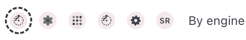
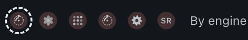
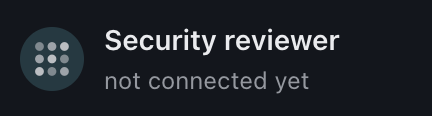
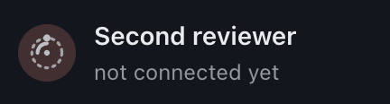
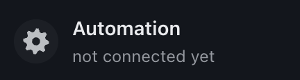

# Self-hosting OpenADLC

OpenADLC is single-tenant: one install, one crew, working in the repositories its
GitHub App is installed on — a person's, an organization's, or both. Everything
runs on infrastructure you control.

## Requirements

| Thing | Why |
|---|---|
| Node 22+ and pnpm 10+ | The platform is a TypeScript monorepo |
| git | Bots clone, branch and push |
| python3, make, g++ (`build-essential`), on Linux | `pnpm install` compiles node-pty, which has prebuilt binaries only for macOS and Windows |
| tmux | Sessions are tmux sessions; take-over is `tmux attach` |
| PostgreSQL 16 | `fleetadlc_db`. `fleetadlc up` starts one in a container if Docker is present |
| Docker (recommended) | The `docker` driver gives each task a container of its own, and a database of its own on the host's task database server |
| The bot image | Each task's container runs it. Build with `infra/local/build-bot-image.sh` |
| cloudflared, on a laptop | The console's webhook step runs a quick tunnel with it, so GitHub's webhooks reach this machine. An install with a public URL of its own does not need it |

Without Docker, the `local` driver runs the same tmux sessions on the host, as
your user. A session there can read the App's private key, every bot's sign-in,
the model keys and the database password, and can run anything on the machine.
It is fine for development with a throwaway App, accounts and repositories; use
Docker for anything that matters. A new install takes `docker` when Docker
answers and the bot image is built, and `local` otherwise; `fleetadlc init`
writes the choice to `install.json`, and `fleetadlc up` warns at every start
while the driver is `local`. To switch: `infra/local/build-bot-image.sh`, then
`fleetadlc init --driver docker` and `fleetadlc down && fleetadlc up`.

The `docker` driver's suites have run on macOS, under Docker Desktop and
OrbStack, and not yet on a Linux host ([unverified](unverified.md#open),
U28 to U30 and U51). On Linux, file ownership and the address a container reaches
the host on differ, and that one task's container cannot reach another's has
not been seen holding there.

Neither driver restricts where a task connects. Only the Google Cloud install,
`infra/gcp`, limits a task to GitHub, package registries and its model; on a
laptop, compose or other host a task can reach anything the host can. See
[Egress](security.md#egress).

### Building the bot image

The `docker` driver runs every bot from one image, and it is not published
anywhere — you build it:

```bash
infra/local/build-bot-image.sh            # tags fleetadlc-bot:latest

# For a cloud install, build the same thing for the host's architecture,
# under the registry's name, and push (Installing on a cloud sets the registry up):
DOCKER_DEFAULT_PLATFORM=linux/amd64 IMAGE=us-central1-docker.pkg.dev/<project>/fleetadlc/bot:latest infra/local/build-bot-image.sh
docker push us-central1-docker.pkg.dev/<project>/fleetadlc/bot:latest
```

The cloud host runs `linux/amd64` only. Without `DOCKER_DEFAULT_PLATFORM`, an
Apple-silicon Mac builds an arm64 image, the host's pull finds nothing it can
run, and hostd never starts.

The engine CLIs are pinned in that script, and the script refuses to finish if
they are not on the PATH inside the image it just built, or are not the versions
pinned. The pins are where an install starts; [System](#engine-updates)
keeps them current after that, along with the GitHub CLI and Node once an
update has recorded those versions. One script for both
installs, so a laptop and a cloud host cannot end up running different bots.

`fleetadlc up` refuses to start under the `docker` driver when the image is absent,
rather than coming up healthy and failing every task.

### Third-party notices for an image you publish

**Do not publish a bot image that contains Claude Code.** `build-bot-image.sh`
always installs it, beside Codex and Grok. Claude Code is Anthropic's
proprietary software under Anthropic's terms: its licence lets you install it
for your own use, not redistribute it. (The Codex and Grok CLIs at the pinned
versions are Apache-2.0.) Keep the bot image the script builds on the machine
that built it, or in a private registry that only your install pulls from, as
the cloud install does. The rest of this section is for the service and
console images, which install no engine CLI, and for a bot image you build
yourself with `docker build -f infra/local/Dockerfile.bot` and an
`ENGINE_CLI_PACKAGES` that leaves Claude Code out.

The images carry OpenADLC's own LICENSE and NOTICE (the console's also its
THIRD_PARTY_NOTICES), but not the licences of everything they install: the
Debian packages, Node, the engine CLIs and the npm packages. Those are not
baked in. Anyone who publishes an image — pushes it to a registry others pull
from, or hands it on — lists them from the built image and ships the list with
it:

```bash
infra/local/third-party-notices.sh <service or console image> service-notices.txt
infra/local/third-party-notices.sh <bot image built without Claude Code> bot-notices.txt
```

The script runs the image once, as root and with no network, and reads
`/usr/share/doc/<package>/copyright` for each Debian package,
`/usr/local/share/doc` (Node's LICENSE in the bot image), and the LICENSE,
LICENCE, COPYING and NOTICE files of every npm package in it, global ones,
corepack's pnpm and an app's `node_modules` included; it says which package each
engine CLI comes from. Nothing is added to the image. Run it again for every
image you publish: each build can install different versions. Run against an
image that holds Claude Code, the list quotes its licence as the package ships
it; that is a notice, not permission to pass the image on. An image you build
and run yourself, and do not pass on, needs none of this.

## 1. Bring the stack up

[`infra/local/install.sh`](../infra/local/install.sh) does this section and
the [Requirements](#requirements) in one command, on macOS (Homebrew) or Linux
(apt or dnf), asking before it installs anything; the README's quick start
runs it. It is safe to run again. By hand, it is:

```bash
pnpm install
pnpm build
infra/local/build-bot-image.sh                     # the image each bot runs
node apps/cli/bin/fleetadlc.mjs init --driver docker   # writes ~/.fleetadlc/install.json
node apps/cli/bin/fleetadlc.mjs up
```

This applies migrations, loads `config/`, and starts hostd, the bridge and the
console. The bridge also dispatches: it decides what starts next as soon as an
issue changes, a task ends or a pull request closes, and every five minutes
besides. Open the console link it prints, which signs your browser in and
redirects to the walkthrough until the install is finished.

`fleetadlc` in the rest of this document is `node apps/cli/bin/fleetadlc.mjs`, run from
the checkout, or `pnpm fleetadlc` ([cli.md](cli.md)). Every command acts on the
install `FLEETADLC_HOME` points at, `~/.fleetadlc` by default, and the ports and paths
below are that default install's.

There is no demo mode ([why](#7-give-the-bots-engines)): an install is either
live or not configured yet. Nothing reaches GitHub before you supply
credentials, and a bot whose engine is missing fails its task rather than
pretending.

Ports default to 47300 (console), 47311 (bridge), 47312 (hostd) and 47432
(postgres) — deliberately uncommon, so they are unlikely to collide with anything
(and `fleetadlc up` refuses to start a service whose port something else already
answers on). Under the
docker driver, the task database server (`fleetadlc-taskdb`) also uses 47433,
published on loopback (Docker Desktop, OrbStack) or on the Docker bridge's
gateway (Linux).

The database container `fleetadlc up` makes, `fleetadlc-db`, is published on
127.0.0.1 only, and its password is generated for the install and kept in
`databaseUrl` in `install.json`. An install from before that had `fleetadlc`
as its password, which is printed in this repository, and its container
published on every address. An install from before the rename still has the
older superuser, user and password both `fleet`, on `fleet-db`. The next
`fleetadlc up` changes either password in place. `fleetadlc doctor` looks at
whichever of those containers is the one in use, so it reports both the
password and a publish on every address. The address needs the container made
again, which `up` does not do, since the data is in the container's own
volume; `fleetadlc doctor` warns until it is done. To keep the data, start a
new container on the old one's volume (use `fleet-db` in place of `fleetadlc-db`
when that is still the container's name):

```bash
fleetadlc down
docker stop fleetadlc-db && docker rename fleetadlc-db fleetadlc-db-old
docker run -d --name fleetadlc-db --volumes-from fleetadlc-db-old \
  -p 127.0.0.1:47432:5432 pgvector/pgvector:pg16
fleetadlc up
docker rm fleetadlc-db-old     # once the install is back; not -v, which would delete the data
```

`fleetadlc up` prints the console as a sign-in link,
`http://127.0.0.1:47300/signin?token=…`. Open it: the console serves nothing to
a browser that has not signed in, because its server holds the console secret
the bridge serves `/v1` for (`console-api-secret` in the secret store, made on
the first `fleetadlc up`). The link works for an hour and the browser then
stays signed in for thirty days; `fleetadlc console-link` prints a fresh link
whenever you need one. The console listens on 127.0.0.1. To open it from
another machine, start it with `FLEETADLC_CONSOLE_HOST=0.0.0.0` (and add the
name you use to `FLEETADLC_ALLOWED_HOSTS`), then open a link from
`fleetadlc console-link` with that machine's name in place of `127.0.0.1`.

### Or with Docker Compose

[`infra/local/docker-compose.yml`](../infra/local/docker-compose.yml) runs the
database, the bridge, hostd and the console in containers. The bridge, hostd and
the console are on the same ports as `fleetadlc up`, so run one or the other; the
database is not published on the host, since the services reach it on the
compose network. hostd runs the bots with the docker driver, through the host's
Docker socket.

The database's password is `POSTGRES_PASSWORD`, and the stack refuses to start
without it. Generate it once, keep it, and export it in every shell that runs
`docker compose` against this file:

```bash
mkdir -p ~/.fleetadlc-compose          # or FLEETADLC_COMPOSE_HOME=/some/absolute/path
(umask 077; openssl rand -hex 32 > ~/.fleetadlc-compose/postgres-password)
export POSTGRES_PASSWORD="$(cat ~/.fleetadlc-compose/postgres-password)"
docker compose -f infra/local/docker-compose.yml up -d --build
```

Use hex, as above: the value is also put into the services' `DATABASE_URL`,
where other characters would have to be escaped.

**A compose stack from before `POSTGRES_PASSWORD` was required** had the
password `fleetadlc`, printed in this repository, and published the database on
every address. The password is kept in the database itself, so a new
`POSTGRES_PASSWORD` alone changes only the services' URL, and they could no
longer connect. Change it in the database first, then restart with the new
value:

```bash
(umask 077; openssl rand -hex 32 > ~/.fleetadlc-compose/postgres-password)
export POSTGRES_PASSWORD="$(cat ~/.fleetadlc-compose/postgres-password)"
# if the stack is stopped, start only the database: docker compose -f infra/local/docker-compose.yml up -d db
docker compose -f infra/local/docker-compose.yml exec db psql -U fleetadlc -d fleetadlc_db -c "ALTER ROLE fleetadlc PASSWORD '$POSTGRES_PASSWORD'"
docker compose -f infra/local/docker-compose.yml up -d
```

The console image turns Next.js's anonymous usage telemetry off
(`NEXT_TELEMETRY_DISABLED=1`). A console built or started from a checkout, as
`fleetadlc up` does, has it on unless that is set in the environment, or
`pnpm --filter @fleetadlc/console exec next telemetry disable` was run once.

A one-shot `setup` service applies the migrations and loads `config/` first, as
`fleetadlc up` does; as there, only a failed migration keeps the services from
starting, and a problem loading `config/` is in `setup`'s log.

The bridge and the console run as uid 1000, the images' `node` user, not as
root. hostd starts as root only to copy the bots' assets, then runs as uid 1000
too, with the Docker socket's group so it can still drive the bots' containers,
as it does on the cloud host. So `home/` and `work/` in the install directory,
below, are owned by uid 1000, and `assets/` by root. `setup` sees to that on
every start: it hands to uid 1000 whatever under `home/`, `work/` and the
`webhook-secret` volume is not already its, which on a stack the older,
root-run images made is everything, and does nothing once it is done. There is
nothing to run by hand. If it cannot change an owner, it stops, naming the
path, and the bridge and hostd do not start. On Docker Desktop and OrbStack the
mount maps ownership for you, and `setup` leaves the directory as it is.

Everything the install keeps but the database and the bridge's first webhook
secret (two named volumes, `db` and `webhook-secret`) is in one directory on the
host, `FLEETADLC_COMPOSE_HOME` (`~/.fleetadlc-compose` unless you set it), mounted
into hostd and the bridge **at the same absolute path**:

| Inside it | What it is |
|---|---|
| `home/` | `FLEETADLC_HOME`: the secret store (`home/secrets`) — the secret hostd and the bridge authenticate each other with, the console secret, the crew's GitHub sign-ins and the model-account keys — and subscription logins |
| `work/` | One mirror per repository, and each task's clone under its bot's folder |
| `assets/` | The skills, roles, skill runner and `gh` the bots are given, copied out of the image each time hostd starts |

The same path on both sides is what lets a bot task run. Every bind mount hostd
gives a bot's container is resolved by the host's Docker daemon, so each has to
be a path that exists on the host; one that exists only inside hostd's container
gave the bot an empty directory, and a task there had no repository. A bot's
container reaches the bridge and hostd on the ports published on the host
(`FLEETADLC_HOSTD_TASK_BRIDGE_URL`, `FLEETADLC_HOSTD_TASK_HOSTD_URL`), since it cannot resolve their
compose names.

`setup` also makes the console secret, `home/secrets/console-api-secret.secret`,
when it is missing. The console is given that one file, read-only, and not the
rest of the home, and is published on 127.0.0.1 unless you set
`FLEETADLC_CONSOLE_HOST`. Print a sign-in link for it with

```bash
FLEETADLC_HOME=~/.fleetadlc-compose/home pnpm fleetadlc console-link
```

`FLEETADLC_COMPOSE_HOME` must be an absolute path, and `FLEETADLC_BRIDGE_PORT` and
`FLEETADLC_HOSTD_PORT` move together; hostd refuses to start otherwise, since either
would send this install's tasks somewhere else. Its task containers, task network
and task database server are named after the compose project
(`<project>-bot-task-<id8>`, `<project>-bot-tasks`, `<project>-bot-taskdb`) and
labelled with it (`fleetadlc.install=compose-<project>`), so they are never the
containers of an install `fleetadlc up` runs on the same machine, and a hostd never
reuses or removes a container another install made. They run an image of the project's own,
`compose-<project>-bot:latest`, which hostd builds with
`infra/local/build-bot-image.sh` on its first start (a few minutes) and which the
weekly engine update replaces and rolls back without touching `fleetadlc-bot:latest`.

`FLEETADLC_COMPOSE_HOME` is not `~/.fleetadlc`, so `fleetadlc` commands run on the
machine do not see this install; run them in the bridge's container instead, which runs as
uid 1000, so anything a command writes stays readable by the services. The CLI asks the bridge at
127.0.0.1, which is that container's own; in hostd's container nothing answers
there, and `doctor` skips the bridge's health checks while the `github`
commands report the automation account as not connected:

```bash
docker compose -f infra/local/docker-compose.yml exec bridge node apps/cli/dist/main.js doctor
```

There `doctor` cannot reach hostd or the console, so it reports them as not
running and skips hostd's authentication check; the compose stack's own
`docker compose ps` is what says they are up.

That directory holds the install's sign-ins and keys. `docker compose down -v`
keeps it, since it is not a volume; deleting the directory means connecting
every account again. The webhook signing secret is in its secret store too,
once the console has set up the app or the webhook; before that it is in the
`webhook-secret` volume. `down -v` deletes both volumes, `db` and
`webhook-secret`: the board, the settings (the app's client id among them),
the crew's account assignments, the model accounts and that first secret. Take
a `fleetadlc backup` first, and expect to go through the walkthrough again
afterwards.

## 2. Create the GitHub accounts

**Open http://127.0.0.1:47300/onboarding and work down it** (signed in with the
link `fleetadlc up` printed, or one from `fleetadlc console-link`). The GitHub accounts
step asks for two accounts — one that does the work and one that approves it —
with a suggested address and username, and a connect button that runs the device
flow for the account, not for a seat. The Crew step is where each bot is put on
one of those accounts, and it stays open while a seat has no account or a bot
that commits has no signing key on its account. That console page is the only
walkthrough; there is no terminal one.

Each step has an address, `/onboarding?step=<key>`.

What it is walking you through, for the record:

Two real accounts at the least — a crew account and a reviewer account — or up to
one per bot. The reviewers can never share the crew account: GitHub won't let the
account that opened a pull request approve it, and the walkthrough refuses it.
Afterwards, **Settings → GitHub → Connected accounts** lists the accounts OpenADLC
holds and which bots use each: connect another account there (for no bot yet),
reconnect one, or disconnect one no bot uses. **Settings → Crew** is where each
bot is put on an account, and where its model is chosen. The bridge refuses a
reviewer on the crew account (and a crew bot on the reviewers'), and an account
whose sign-in has stopped working, whatever the page offers. No bot may be a
person: an account that is one of the install's `humans`, or that a managed
repository's AGENTS.md names under Human review, is refused when a seat
connects, when an account is connected here, and in Crew's choices, which say
why beside it. Connecting a seat, or putting one on an account, is refused too
when GitHub says the account has admin or maintain on a managed repository;
the refusal names the repository and the role to lower it to. If the code was
approved in a browser signed in as you, sign in as the bot's own account (a
private window helps) and enter a new code. A Reconnect that GitHub approved
as another account says so under that row — which account approved it, and
that the row's account still needs reconnecting — and offers to disconnect the
other account when no bot uses it. Taking a bot off its
account, or moving it to another, is asked once more on its row, and the bridge
refuses it while the bot has a task that has not ended or holds a lease: stop the
task or let it finish, then move it. A bot on no account is put on one straight
away. Taking the last bot off an account leaves the account connected, used by
no bot, until you disconnect it. **Settings → Appearance** is where each repository's color and
each crew member's color are chosen; a repository's color is on its own page as
well. A crew member's color is By role until someone chooses one, which is the
tint its role already has.

`config/bots.yaml` lists the crew as seats — what each bot is for — and names no
account:

| Seat | Role | What it does |
|---|---|---|
| `intake` | intake | Clarifies everything a request needs with the person who asked, one question at a time, reading the files they gave, and files the issue they agree to |
| `system-engineer` | system engineer | Writes the design as an issue comment, stops on architectural choices, and opens pull requests that add ADRs under `docs/adr/` when a person decides to record a decision |
| `builder` | builder | Branches, implements inside declared paths, runs the checks, opens the pull request |
| `lead-reviewer` | lead reviewer | Correctness and contract; GitHub requires this review |
| `second-reviewer` | second reviewer | Quality and edges, on a different model so two reviewers do not share a blind spot |
| `security-reviewer` | security reviewer | Secrets, authorization, injection, dependencies |
| `sre` | SRE | Reverts a change whose smoke failed on testing, instead of fixing forward; diagnoses a failed testing deploy and fixes a broken deploy workflow by pull request; and reviews workflow, runbook and infrastructure changes as the workflows lens; shipping follows the repository's rules |
| `qa` | QA | Journeys, smoke and visual suites |
| `automation` | automation | Labels, assignments, reviewer requests and the `review-gate` status; never pushes |

For each account: a unique email, two-factor authentication, its email kept
private, and access to the repositories the crew works in, which OpenADLC gives
it by inviting it as a collaborator with the role its seat needs (below).

Keep each account's email private: signed in as the account, open
[github.com/settings/emails](https://github.com/settings/emails) and tick **Keep
my email addresses private** and **Block command line pushes that expose my
email**. The bots' own commits use the account's noreply address, but the commits
GitHub writes for the crew — the squash merge of each pull request, and the
merges that bring a branch up to date — use the account's default commit email.
Without the setting, every crew pull request merged in a public repository
publishes your address, and its `+fleetadlc-<seat>` tag says what it is for. The
`commit-email` check reads the newest commit GitHub wrote for each account and
raises a warning card when it carries the account's own address.

Worth knowing before you create the accounts:

- **GitHub limits free machine accounts.** GitHub's
  [Terms of Service](https://docs.github.com/en/site-policy/github-terms/github-terms-of-service#3-account-requirements)
  allow machine accounts but allow each person no more than one free one, in
  addition to their free personal account. The limit applies to the accounts
  themselves and is not changed by putting them in an organization — an
  organization admits accounts, it does not own them. The person who creates a
  machine account accepts GitHub's terms for it and is ultimately responsible
  for what it does, even when, as GitHub allows, several people direct it. So
  the two required accounts are one free machine account and one on a paid
  plan, or free machine accounts created by two people who each take that
  responsibility for their own. Each account beyond those needs a paid plan or
  another such person. Our advice, which is OpenADLC's and not a GitHub rule:
  do not ask someone to create an account they will not stand behind, and do
  not create one in someone else's name; GitHub may suspend accounts it finds
  created to get around the limit, and the crew's work stops with them.
  Neither account should be your personal account: OpenADLC treats everything
  that account writes as the bot's. More accounts are optional, because every
  seat can share the crew account or the reviewer account. Check GitHub's
  current terms before you create them; this paragraph summarises them and is
  not legal advice.
- GitHub needs a distinct address per account, and most providers deliver
  `you+anything@` to the same inbox — so `you+fleetadlc-builder@` and
  `you+fleetadlc-lead-reviewer@` put the crew's mail in one mailbox. Onboarding
  suggests these from your own address. A distinct address does not change
  how many free accounts GitHub allows you.
- **Who owns the repository does not change how OpenADLC works.** A person and an
  organization both share a repository with the bot accounts as collaborators,
  and both send an invitation when they do. What differs is one role and what
  the plan will enforce, below.

### What a bot is called

A bot is the account it acts as, so that is what it goes by. Until an account
is assigned on the Crew step, a bot is named after its seat. Whichever account
it is put on is the one it is: when it has that account to itself, the bot
takes the account's login, lowercased, as its name, and from then on the
console shows it by that handle, with its role beside it where there is room —
*irisexampleco · second reviewer*. Seats that share one account keep their
seats' names, since bots all called by one login could not be told apart.

Everything the bot has is kept under that name — its folder under
`~/.fleetadlc/work`, its secret files under `~/.fleetadlc/secrets`, and its sessions
(`<bot>/<skill>-<task>`) — so all of it moves when the bot is renamed. Its tasks'
computers — the container each task runs in — are named after the tasks, not the bot. A bot is never renamed in the middle of a task: one that is
working is renamed once it has finished. The seat does not move. It is what
`fleetadlc up` finds the bot by and what a repository's `owner` names, so connecting
an account never changes the configuration.

Nothing is reserved in advance. `config/bots.yaml` names no account, so none can
be set aside for a bot nobody has connected — which is how an install once refused
the account its operator actually had, because the configuration had promised it
to another bot. The username the walkthrough offers is a suggestion, made from the
role and the name of the account that owns the repositories (such as
`acme-fleetadlc-builder`) and checked against GitHub before it is offered. An account
you already have works as well.

### How a bot looks

Each bot's avatar is drawn in its role's tint, so the crew can be told apart at
a glance. Two seats of one role, such as two builders, share a tint until
one of them is given a color of its own. Choose it in **Settings → Appearance →
Crew colors and avatars**, from eight named tints or *By role*. It is stored per bot, audited
as `bot.color_changed`, and used wherever the bot's avatar appears: the board,
its thread, /crew and Settings. `config/bots.yaml` names no color, and `fleetadlc up`
leaves a chosen one alone.

On the tint is a small mark for the engine the bot thinks with: petals for
Claude, a dot grid for Codex, an orbit for Grok, and a gear for the automation
bot. These are marks drawn for OpenADLC, not the vendors' logos. A mark moves
only while its bot is working, and only where the avatar is large (a crew
card, a thread's head, a message). It is still everywhere else, including on
the board, and still for anyone whose system asks for reduced motion. Choose
another mark, or the bot's two initials, in **Settings → Appearance → Crew
colors and avatars**, or, as an admin, in the Settings tab of its panel on
**/crew** (click its card). *By engine* is the default,
so a bot moved to another engine takes that engine's mark. The choice is stored
per bot and audited as `bot.avatar_changed`. A backup keeps each bot's color and
avatar, and a restore puts them back with the seat.

| The picker, light | The picker, dark |
|---|---|
|  |  |

The engine marks, each on a crew card:

| Engine | Mark |
|---|---|
| claude |  |
| codex |  |
| grok |  |
| the automation bot |  |

### Accepting the repository invitations

OpenADLC lets each bot into a repository the same way whoever owns it: it invites
the account as a collaborator. On an organization, GitHub adds an account that
is already a member of it directly; any other gets an invitation, as on a
person's repository.

GitHub sends each bot that is not in yet an invitation, and a bot does nothing
at all until it is accepted. This is the step that strands an install
quietly: the account is connected, its token is valid, `fleetadlc auth status` says
so — and every call 404s, because an invitation is sitting unread in a mailbox.

OpenADLC accepts them with the bot's own credential, the one the device flow
produced. Nothing else is needed — **provided the app has `Administration: read
and write`**. Without it:

```
$ curl -sD- -X PATCH -H "authorization: Bearer $GHU_TOKEN" \
    https://api.github.com/user/repository_invitations/<invitation-id>
HTTP/2 403
x-accepted-github-permissions: administration=write
{"message":"Resource not accessible by integration"}
```

`Resource not accessible by integration` reads like a limit of app tokens. It is
not: the header beside it names the permission, and with that granted the
identical call returns `204`. `$GHU_TOKEN` is the bot's own token, which a
session of that bot holds as `$GH_TOKEN`; your own token gets a different
answer, and a bot's token is never refreshed by hand, since GitHub rotates the
refresh token and the bot would be disconnected.

`Administration` is a wide permission — *"Repository creation, deletion,
settings, teams, and collaborators"* — and it lands on every bot's token, not
only the ones being invited. It is also the permission that edits whatever
rulesets the repository has. That is the price of not signing in as nine
accounts by hand, and it is the same price whoever owns the repository.

**OpenADLC sends the invitations, which is how it knows their ids.**

Finding an invitation is the half that cannot be done. All three routes are
closed to an app token, measured:

| Route | Answer |
|---|---|
| `GET /user/repository_invitations` | `200 []` — evaluated against a repository the invitee cannot see yet, so empty is indistinguishable from none |
| `GET /repos/{owner}/{repo}/invitations` | `403`, naming `private_repository_invitations=read`, which no GitHub App can be granted |
| a `repository_invitation` webhook | no such event to subscribe to |

So OpenADLC does not look for one. It **creates** it:
`PUT /repos/{owner}/{repo}/collaborators/{username}` returns the invitation it
just made, id included, and the bot that invitation names then presents that id
to `PATCH /user/repository_invitations/{id}`.

Two identities, because neither can do both halves. Inviting needs admin on the
repository, and the crew are collaborators — so the **app** invites, using an
installation token, which carries the app's permissions without being
intersected by any account's access. Accepting can only be done by the invitee
— so each **bot** accepts its own, with the credential it already has.

That needs the app's private key, which is the one credential here that is not
per bot and the widest: paste it into the console at the step where you create
the app. It is stored where the refresh tokens are, never returned to the page,
and never given to a task under the docker driver; under local a task can read
it. The merge line, the `review-gate` check and the repository's rules need it
too, so an install without it never merges anything; only the invitations have
a way round it, by hand with the `gh` path in the console.

The walkthrough's **Repository access** step,
and **Try again** on a repository in settings, invite every bot
that is not in yet and accept for it. The `bot-access` check says which accounts
are in each repository and which are still outside, with **Let the crew in** on
its card, so this is visible rather than discovered at the first failed push.

The role each seat is invited with is the least its work needs:

| Seats | Repository role |
|---|---|
| builder, system engineer, SRE, QA | write; the lease, and the merge line that holds a crew pull request to it, keep each to its paths |
| the three reviewers | write, because an approval only counts from an account with write access |
| intake and automation | triage on an organization's repository; write on a person's, whose access page has no triage |

Where intake and the automation account hold write, what keeps them from pushing
is OpenADLC's own gates: neither ever authors a commit. Seats that share an account
share its role, which is the widest any of them needs.

## 3. Create one GitHub App as the OAuth client

Settings → Developer settings → GitHub Apps → New GitHub App.

- **Name:** one no other app on GitHub has; GitHub app names are unique across
  all of GitHub.
- **Device flow:** enabled. Without it, `fleetadlc auth login` cannot work.
- **Expire user authorization tokens:** on. This is what makes user tokens last
  eight hours and issue a refresh token.
- **Webhook URL:** your bridge's `/webhooks/github`, with any secret for now:
  the walkthrough's Webhook step replaces it with the install's own once
  OpenADLC holds the app's private key, writing one secret to both sides.
  Exporting `FLEETADLC_WEBHOOK_SECRET` does not set it: that variable is read
  only before `fleetadlc init` has generated a secret, and afterwards the one in
  the secret store wins.
- **Permissions:** under Repository permissions, read and write on contents,
  issues, pull requests, commit statuses, checks, workflows, actions and
  **administration**, and read-only on deployments and metadata; under Account
  permissions, read and write on SSH signing keys. None under Organization
  permissions: OpenADLC asks nothing of an organization. A user token is limited by the
  intersection of the app's permissions and the account's own access, so the
  app is the outer bound and the account's role on the repository is the real
  limit.
- **Subscribe to events:** issues, issue comment, pull request, pull request
  review, workflow run and deployment status.
- Install the app on the repositories the crew works in — on each account they
  belong to, when that is more than one (below).

An app has four parts OpenADLC holds: the **client id**, the **private key**, the
**webhook secret** and the **client secret**. The client secret is what narrows
each task's GitHub token to the task's own repository
([the security model](security.md#the-account)). For an app made by hand,
generate one on the app's page under **Client secrets** and paste it into
Settings → GitHub → **App client secret**; GitHub shows it once. Without it a
task's token reaches every repository its bot can, and the `app-client-secret`
check says so on the board.

`Administration` is the one whose absence is hardest to diagnose. Without it the
app cannot invite a bot, a bot cannot accept its own invitation and the
repository's rules cannot be applied, and GitHub reports each as the misleading
`403` shown under
[Accepting the repository invitations](#accepting-the-repository-invitations).
The webhook is not among them: it is the app's own setting, written with the
app's private key, so no repository permission affects it.

**The console can create this app for you.** The walkthrough's app step builds a
GitHub App manifest with the permissions, events and webhook address filled in,
and hands you to GitHub to confirm it, which is fewer chances to miss a checkbox
than doing it by hand. Two settings no manifest can carry, **Enable Device
Flow** and **Expire user authorization tokens**, are then ticked on the app's
settings page; until Device Flow is on, a board check says so and no bot can
sign in. Installing the app is a step of its own.
GitHub sends back all four parts, and the bridge stores them. An app the console
made before it kept the client secret needs one pasted, as a hand-made app does.
The console proposes a name unique to each attempt — `OpenADLC (<owner>)` and
a short random ending, within GitHub's length — so a second install, or "create
a different app instead", is not refused for a name already taken. If GitHub
still says the name is taken or too long, change it on GitHub's page: OpenADLC
keeps the app's id and key, not its name.

**An app created before OpenADLC asked for deployments** has neither the permission
nor the event, because a manifest decides them only for the app it creates. Until
both are added, GitHub sends no `deployment_status`, so no change is labelled
`deployed:testing` or `deployed:prod` and no promote moves a card to Done. The
`app-permissions` check says so on the board and in `fleetadlc doctor`, with a link to
the page. On GitHub: **Settings → Developer settings → GitHub Apps → your app →
Permissions & events** (under the organization's settings for an app an
organization owns), then:

1. **Repository permissions → Deployments:** Read-only.
2. **Subscribe to events → Deployment status:** ticked. It is offered once the
   app may read deployments.
3. **Save changes.** GitHub then asks each account the app is installed on to
   accept the new permission, on the installation's page; the same check links
   there until it is accepted.

OpenADLC acts as the app for the repository's administration and its merge
line: inviting a collaborator, writing the repository's rules and environments,
committing CODEOWNERS and the templates when you press Apply, merging, the
`review-gate` check, the `adlc:ci` label and draft changes on a pull request,
re-running failed CI, dispatching deploys, and pointing the webhook at this
bridge. Those merges and commits appear as the app's bot. Reviews and comments
never do: they come from a bot's own account.

### Repositories under more than one account

The app is installed on each account on its own — a person's, an organization's
— and OpenADLC works only in the repositories an installation covers. Settings →
**GitHub App** lists each account OpenADLC works in, installed or not, with the page
on GitHub where each is changed. A repository typed into **Add a repository** that
the app cannot reach is not added: the field says what to do first and, while
the page stays open, adds it once GitHub says the app can reach it.

The walkthrough creates the app **private**, and GitHub installs a private app
only on the account that owns it. So an app made under a personal account such as `janedoe` cannot be
installed on an organization such as `exampleco` until its owner transfers the app to that organization.
**Install on another account** explains the transfer and what making the app public instead costs, and
links to the app's Advanced settings, where either is done. No API can do that.
A public app can be installed by any account, and cannot be made private
again while another account has it installed. OpenADLC works only in the
accounts it knows: the app's owner, the organization in its settings, the
accounts of the repositories it already has, and accounts an admin has
allowed. An installation anywhere else is ignored: its repositories are not
offered in the picker, and one typed in is refused, saying how to allow the
account. To work in a second account, an admin allows it — **Allow <account>**
in the field, after a warning that the crew will be invited to its
repositories and that whoever can write there can answer the crew's
questions (`POST /v1/github/allowed-accounts`, audited as
`github.account_allowed`) — and then installs the app there as above. See
[the security model](security.md#the-account).

On an organization only an owner can install the app; a member who tries sends
the owners a request. OpenADLC then invites each bot as a collaborator, which GitHub
turns into an addition for a bot that is already a member. An organization that
does not allow outside collaborators refuses the rest, and each bot's line in
settings says so; its owners make those bots members instead. Then set the
organization's base permission to **No permission**, keep the bots out of
teams, and grant each bot access per repository: a member's token reaches every
repository it sees through the base permission or a team, and a crew session's
token is the app's installation intersected with that.

Each installation's own page — linked beside every account under **GitHub App** —
is where an account gives the app more of its repositories. Choose **Only select
repositories** and pick the ones the crew works in. An organization's installation
on all of its repositories, with the bots its members, lets a crew token reach
repositories OpenADLC does not manage; the `app-selection` check warns when an
organization OpenADLC works in has one.

## 4. Configure and connect

An install brought up in step 1 is already configured here: `fleetadlc init`
there set the driver and the database url, and generated a webhook secret, as
it does whenever the install has none. The account the repositories belong to,
the app client id, the operator's address, the webhook and who may answer gates
are asked for by the console's walkthrough and stored in the database, so an
install can be configured from a browser without editing a file or restarting
anything.

The walkthrough's GitHub accounts and Crew steps (step 2) also connect the
accounts and put each seat on one: its connect button runs the device flow
for an account. The terminal does the same, for a seat at a time or for all of
them, once `fleetadlc up` is running:

```bash
fleetadlc init --driver docker   # only for an install step 1 did not set up; also takes --database-url
fleetadlc up                     # the bridge is what connects each seat
fleetadlc auth login --all       # or --bot <seat>
```

For each seat the CLI prints a code, and whichever account approves it becomes
the seat's account:

```
  › Sign in to GitHub as acme-fleetadlc-lead-reviewer (not as yourself) and approve the OpenADLC app.
    open https://github.com/login/device and enter this code:

    WDJB-MJHT
```

Sign in **as the account for that seat** — the crew account for a crew seat,
the reviewer account for a reviewer — not as yourself, enter the code, approve. The CLI hands the
sign-in to the bridge, which connects the seat exactly as the console's
walkthrough does: it stores the refresh token under `~/.fleetadlc/secrets` with
`0600` permissions, generates an SSH signing key, uploads the public half to
the account, and records the refresh token's expiry: the scheduler's
credential job opens an issue three weeks before it runs out. The bot then takes the account's handle as its name,
unless other seats share the account.
`fleetadlc auth login --bot lead-reviewer` connects one seat. With the bridge
not running, the CLI stores nothing and says to run `fleetadlc up` first.

Seats can share an account, as in the two-account crew above. A seat that
signs in as an account another seat of its group is already on joins that
account: the newer sign-in becomes the account's, every seat on it uses it, and
the seat keeps its own name, signing key and computer. A reviewer seat signing
in as the crew's account, or a crew seat as the reviewers', is refused, because
GitHub won't let the account that opened a pull request approve it. A seat
that signs in as a different account than before leaves its old one first, so
the other seats on that account keep working.

`--all` asks for each seat in turn; a seat whose group's account is already
connected joins it once you approve as that account. Whichever way, connecting
an account is a person's step, because GitHub requires a browser sign-in: the
console's connect button, or the code the CLI prints. After it, nothing needs
rotating on a schedule.

```bash
fleetadlc auth status     # which accounts are connected
fleetadlc doctor          # tools, database, host heartbeat, accounts, spend
```

## 5. Point it at repositories

Edit [`config/repos.yaml`](../config/repos.yaml):

```yaml
organization: exampleco     # read, not used: it may be left out
repos:
  - name: your-service
    fullName: exampleco/your-service   # a person's repository works the same: janedoe/your-service
    owner: builder          # the seat of the builder that owns this repository
    concurrency: 1
    stageModes:
      intake: autonomous
      spec: conditional
      build: autonomous
      review: autonomous
      merged: autonomous    # production asks through its environment's reviewers
```

Which paths need a person's review is not set here. It is the `## Human review`
section of the repository's own `AGENTS.md`, read from its base branch
([§6](#6-protect-the-repositories)).

Run `fleetadlc seed` to load changes, or change the same values from the console's
repositories page (those changes are audited). A setting written in this file
wins at every `fleetadlc up` and `fleetadlc seed`, so a change to it in the console
lasts only until then; a setting the file leaves out keeps the console's value,
or the default a new repository starts with. Each change the seed makes to a
repository already there is audited as `repo.seeded`. Leave out what you want
to manage from the console: the example above sets `stageModes`, so its stages
are put back at every start. `owner` names a seat, so it stays right when the
builder connects an account of its own and takes its handle; one that names no bot is an
error the seed prints, naming it. An entry whose `name` another repository
already has, under a different `fullName`, is refused: the seed names both and
exits non-zero, and leaves that repository as it is.

Each repository gets a color when it is added, the first one no other
repository has. The board tells repositories apart by it, always beside the
name. Change it on the repository's own page, or for every repository at once
in **Settings → Appearance → Repository colors**. Either way it is audited as
`repo.settings`.

### The files a repository needs to be legible

A repository OpenADLC manages needs more than labels and a webhook, and `fleetadlc
github check` says which of these are missing:

| File | Why a bot needs it |
|---|---|
| `.github/workflows/ci.yml` | Publishes the `ci` check the merge line and the ruleset wait for, by running `make setup` and `make ci`; nothing else publishes it, so without it nothing lands. It runs on the repository's own Actions minutes: see [What CI costs a repository](#what-ci-costs-a-repository). |
| `.github/ISSUE_TEMPLATE/task.yml` | Its field labels **are** the headings the platform parses. GitHub renders a form response as `### <label>`, and `Outcome`, `Acceptance criteria`, `Expected paths` and `Verification` are what make an issue routable at all. |
| `.github/ISSUE_TEMPLATE/bug.yml` | A bug filed without the four sections goes back to intake instead of to a builder. |
| `.github/ISSUE_TEMPLATE/config.yml` | Keeps blank issues available, so the form is not something people work around. |
| `.github/pull_request_template.md` | `Closes #N` says which issue a pull request answers. The merge line holds a crew pull request to that issue's lease's paths, and holds one that closes no issue for a person. |
| `AGENTS.md` | How to build and check, and the `## Human review` section the bridge reads reviewer paths from. |
| `.github/CODEOWNERS` (written by the rules, [step 6](#6-protect-the-repositories), not by this check) | Without it, "review from a code owner" on the default branch cannot be satisfied by anyone. |
| `Makefile` | hostd runs `make setup` at task start, and `make ci` when the builder runs `fleetadlc-ci`. |
| `docs/runbooks/README.md`, `docs/adr/README.md`, `docs/adr/0000-template.md` | Reviewed by the workflows lens, and where decisions stop being re-argued. |

```bash
fleetadlc github check     # names the missing ones and why each matters
fleetadlc github apply     # writes only the ones that are absent
```

`apply` never overwrites what a repository wrote. What a repository says about
itself is its own — an `AGENTS.md` that matched the shipped template would be
one nobody had filled in — so this fills gaps and leaves every existing answer
alone. Two things OpenADLC wrote itself and nobody changed are brought up to
date: an `AGENTS.md` still naming the template's `@owner`, and a CI workflow
that is byte for byte an earlier template (see below). Settings → Repositories
lists both as changes to agree to before anything is written.

### What CI costs a repository

The `ci` workflow runs on the repository's own GitHub Actions minutes, so the
template OpenADLC writes runs as little as the merge line needs:

- **A crew pull request** runs CI once, after the lead reviewer approved and at
  the front of the merge line (`adlc:ci`); the builder ran `make ci` on its task's
  computer (container) before that, at no cost in minutes.
- **A change to docs alone** passes without `make setup` or `make ci`. Set
  `DOCS_ALONE_SKIPS: 'false'` in the workflow if your tests read your docs. A
  file moved into `docs/` from elsewhere is not docs alone: it takes code out
  of the build, so it runs.
- **The push to the default branch** after a merge runs nothing again when its
  pull request already passed that exact tree, which a merge the merge line
  made always did. The template runs on a push to `main`, `master` or `trunk`;
  add your default branch to its `push:` filter if it is called something else.
- **A hung run** stops after 30 minutes rather than GitHub's six hours.
- **A first failure** is run again once, as the app, before the work goes back
  to the builder: a rerun costs minutes, sending it back costs a model's round.

What a run costs beyond that is the repository's `make setup` and `make ci`.
Caching dependencies in the workflow (`actions/cache`, or `setup-node`'s
`cache:`, keyed on the lockfile) is usually the biggest saving left. A public
repository's runs on GitHub's standard runners are free.

A repository set up before this template keeps its workflow until it is set up
again: Settings → Repositories offers the current one in place of an earlier
template nobody changed, and leaves an edited one alone.

The shipped copies are in `crew/templates/repo/`. This repository shares the
issue forms and the pull request template with them, kept identical by a test
that also renders the task form the way GitHub does and asks the real parsers,
so a renamed field label fails rather than quietly making every new issue
unroutable. Its workflows are its own, written for building and shipping
OpenADLC itself, and differ from the templates.

## 6. Protect the repositories

The settings are made by a command, not listed here to make by hand, because a
rule an operator has to remember is a rule that will be missing on the
repository that mattered.

What it can actually set depends on the **plan**, not on who owns the
repository. On a private repository, rulesets hold on GitHub Pro (a person's
account), Team and Enterprise; CODEOWNERS on Pro and above; and a required
environment reviewer only on GitHub Enterprise. Where GitHub will hold
nothing, OpenADLC's own gates still do — the review gate, the merge line with
the lease it holds a crew pull request to, and the author check — and `fleetadlc github check` reports which of the two is
carrying the weight.

The console's **Protect the repositories** step in the walkthrough is the
default way to apply them: the bridge writes them as the app, whose key it
holds. The CLI does the same:

```bash
fleetadlc github check     # what is missing, drifted, or cannot be expressed here
fleetadlc github apply     # create it
fleetadlc github check     # confirm it from the outside
```

`github apply` and `github sync-labels` act as the OpenADLC app, with an
installation token for each repository, as the console's repository setup
does, so they need the app's private key on the same machine, as the console's
install has it. Without it they act as the automation account, which needs
admin on the repository for rules and cannot create a label with triage. The
key is also how `apply` learns the app's id, which the rulesets name as their bypass actor and
pin `review-gate` to. Without the key, `apply` leaves a ruleset that already
names the app alone and reports it skipped, rather than take the bypass and the
pin off; use the console's Protect step then.

`check` is read-only and exits non-zero when anything is missing or has drifted,
so it belongs in whatever watches this install. What the two of them cover:

- the **`fleetadlc: main`** ruleset — linear history, no force push, no deletion,
  signed commits, squash-only, one approving review **from a code owner**,
  conversation resolution, and required checks (`ci`, `review-gate`) with
  **branches up to date before merging**;
- the **`fleetadlc: agent and system branches`** ruleset, which stops one bot
  rewriting or deleting another's work branch under `agent/**` and `system/**`
  while leaving each free to create its own. Repairing either one changes only
  what OpenADLC declares there: a rule, a branch or a required check you
  added to it stays, and is not drift. Apply still replaces the bypass actors
  with OpenADLC's own app and removes any exclude pattern, since an exclude can
  carve the default branch back out, and says which patterns it removed. When
  GitHub lets it read only the ruleset's list entry, which has no rules, apply
  leaves the ruleset as it is and says so rather than write over rules it could
  not see. Both name OpenADLC's app as their one bypass actor, in `always`
  mode, so it can write CODEOWNERS to a branch they protect; the merge line
  merges as the app, so what holds its merges is `mergeDecision`, not the
  ruleset, and the app's private key is what guards `main`;
- the **`testing`**, **`production`** and **`production-rollback`**
  environments, each held to the default branch alone by its deployment branch
  policy, and production held as the repository's choice says: a wait timer
  of the soak when it ships automatically after testing (the default), or a
  required reviewer, the person named for it, when a person approves (the
  rollback's waits for nobody). The command asks which for a repository that
  has not said (`--production auto|reviewers`, `--reviewer`, `--soak` for a
  script), and never writes production with an empty reviewer list;
- **`CODEOWNERS`**, written if absent — without it, "review from a code
  owner" on `main` cannot be satisfied by anyone. It is looked for where GitHub
  looks, in `.github/`, then the root, then `docs/`, and the first found is the
  one read and repaired; a new one is written to `.github/` only when none of
  the three exists, and nothing is written while one cannot be read. Who owns
  what is a decision, so an existing file keeps your lines: apply rewrites only
  a `*` line naming crew no longer leading review, and a line owned by nothing
  but the organization, which GitHub cannot ask for a review.

A required check is named by the **job**, not by the workflow. The aggregate job
in `.github/workflows/ci.yml` is `ci`, so the context GitHub publishes is `ci` —
not `workflow / job`, which is what a reusable-workflow call produces. A ruleset that requires a context no job
publishes never goes green and nothing says why, so the name lives in one place,
`REQUIRED_CHECK` in `packages/shared/src/checks.ts`, which the merge line and
`fleetadlc github apply` both read, and a test fails if the workflow's job name drifts
from it.

Two things `check` will tell you that `apply` cannot fix, and reports as
*cannot be expressed* rather than passing over them:

- A **private repository** can require an environment reviewer only on GitHub
  Enterprise, whoever owns it. The environment is still created without one, and
  production is unguarded by GitHub until the repository is public or on that
  plan (below).
- **No repository owned by a user has a Triage role.** Intake and the automation
  account hold `write` there, and what keeps them from pushing is OpenADLC's own
  gates. This is the one functional difference between the two owners, and it is
  the only one.

`AGENTS.md` in the repository is where two things live that are not settings:
how to build and test, and **who has to approve what**.

```markdown
## Human review

- `config/` @you
- `infra/` @you
- `.github/workflows/` @you
```

The bridge reads that section from the **base branch**, never from a pull
request's own copy — otherwise a pull request could edit its way out of the
review it is subject to — and holds `review-gate` until each named person has
approved *the change that would land*: the head, or an earlier head whose diff
against the base is the same, so the merge line bringing an approved branch up
to date does not ask them again. An approval of an earlier commit with a
different diff does not count, nor does one a lead-only conflict resolution
carried over, which the person never saw. Logins match whatever their case. A
file it cannot read holds the gate rather than releasing it.

A pull request that changes the section itself — a line taken out or
rewritten, a heading put in, the section or `AGENTS.md` deleted — waits for
every person the base branch's section names, whatever paths it touches.
`AGENTS.md` is not one of the listed paths, and builders edit it on ordinary
work, so without this a first pull request could take a rule out on the lead's
approval alone. An edit elsewhere in `AGENTS.md` needs nobody.

Each rule is a list item (`-`, `*`, `+` or numbered) with one path, then the
logins who must approve it:

- The path is the first backticked span, or the first word; backticks are
  optional, and a leading `/` or `./` is ignored.
- A plain path is a prefix: `infra` and `infra/` both cover `infra/main.tf`,
  not `infrastructure/`, and a `*` or `**` at its end reads the same way. A
  `*` or `**` anywhere else makes it a glob, matched one folder at a time: a
  `*` stays within one folder's name and a `**` segment is any run of
  folders. `crew/skills/*/tools.yaml` covers every skill's `tools.yaml`, a new
  skill's included, and nothing else in those folders; `*.tf` is a file name
  at any depth.
- Words in parentheses, or after the logins, are a note: `` `infra/` (Terraform) @you ``.
- Sub-headings inside the section group rules; the section ends at a heading of
  its own level or higher.

A line it cannot read — two paths, a team such as `@org/team` (the gate waits
on people), logins with no path — holds the gate on every pull request in the
repository, and the repository-config card names the line and what is wrong
with it.

Naming the person is the point. The label is `review:human:<login>` and the
status says `waiting on @you`, so a path that needs one person's judgement is not
satisfied by somebody else's approval. The app creates a person's label the first
time a pull request needs it, since an automation account with triage may put a
label on but not make one; without an app key, a repository that lacks the
label goes without it, and the gate still waits on the person. Anyone a change does not need has their
automatic CODEOWNERS review request withdrawn, so a person's review queue is the
pull requests that genuinely wait on them.

Everything else `apply` touches is namespaced `fleetadlc:`, and a ruleset it does not
own is left alone.

**The crew never signs off its commits.** OpenADLC asks for no DCO, and a
bot cannot make that certification for a person, so its commits carry an author
and no sign-off line. A repository that enforces
a DCO check of its own must exempt the crew's accounts from it, or their pull
requests and the SRE bot's reverts fail that check and never merge.

**You do not need GitHub's merge queue**, and on most plans you cannot have it:
it is Enterprise Cloud only for private repositories, and absent entirely on a
personal one. The bridge serializes merges instead. When a pull request has its
approvals and its checks, it takes a place in that repository's line; the bridge
brings the one at the front up to date with the base branch, waits for the
checks to report on that new head, and merges it itself, as the OpenADLC GitHub
App, once `mergeDecision` holds: the lead's approval of that head, `ci` and
`review-gate` green on it, and the people AGENTS.md names for its paths. A
repository listed in the `bridgeMergeOff` setting is left to auto-merge or a
person. No bot merges — a bot that could merge could merge around a red check.

The "require branches to be up to date" rule is what makes this hold: without
it, two pull requests that each passed against an older `main` can both land and
leave it broken.

## 7. Give the bots engines

A model credential is an account, added once and shared by every bot assigned
to it. The walkthrough asks for that in two steps: **Foundation model accounts / API keys**,
then **Crew**.

An API key is pasted once on the model accounts step and verified by listing models
before it is stored. Bots sharing a subscription run at the same
time, the way several CLI windows on one laptop do, and share its rate limit
and usage allowance the same way: a busy crew reaches the plan's limit sooner
than it would on separate accounts or API keys. The
crew step proposes a default and lets any bot differ. It also says which
bots cannot run and why — a missing `claude` or `codex` command is fixed by
installing it, not by a key.

After setup, **Settings → AI models** (`/settings#models`) is where an account
is added, signed in again, checked and removed, with the models each one
offers; it is the model accounts step itself, so nothing needs the walkthrough run
again. Which bot uses which account and model is chosen on its row under
**Settings → Crew**. Removing an account a bot still uses is refused, naming
those bots.

The key lives in the secret store under the account. To put it there by hand
instead, once you know the account's id:

```bash
# ~/.fleetadlc/secrets/model-account-<id>.secret, mode 0600
printf '%s' "$ANTHROPIC_API_KEY" > ~/.fleetadlc/secrets/model-account-"$ACCOUNT_ID".secret
chmod 600 ~/.fleetadlc/secrets/model-account-"$ACCOUNT_ID".secret
```

### Subscriptions

**Use an API key unless you have checked.** An API key, or a provider's
business or team plan, is the recommended way to give the crew a model, and
what an install serving more than one person should use. A subscription is
the subscriber's personal account, under the provider's consumer terms. Those
terms may limit automated use, use by software other than the provider's own,
or sharing one sign-in across many concurrent sessions, and they change. Read
the provider's current terms and usage policies before you connect one.
Whether a subscription may drive an automated crew is between you and the
provider: OpenADLC and 620 Legal make no claim that it may, and a provider
that finds an account used against its terms may limit or suspend it, mid-task
included. This section is not legal advice.

A subscription is signed in once and every bot on the account uses that one
sign-in. Nothing needs a terminal except, for Claude, one command.

- **Claude.** On a machine signed in to the subscription, run
  `claude setup-token`. It prints a long-lived token starting `sk-ant-oat`;
  paste it into the account's token field. It is stored as the account's
  secret, like a key (`model-account-<id>`), and a session on the account gets
  it as `CLAUDE_CODE_OAUTH_TOKEN` — never with `ANTHROPIC_API_KEY` beside it,
  which Claude Code would use instead and bill to the API. A token copied out
  of a terminal that wrapped it has a line break in the middle; the field says
  so rather than storing it.
- **Codex and Grok.** Press **Sign in** on the account. hostd runs the CLI's
  own device sign-in — `codex login --device-auth` or `grok login --device-auth`
  — in a throwaway container from the bot image with a home of its own (on
  the host, under the `local` driver), and the console shows the
  link and the one-time code. Finish in your browser; the page notices within
  a few seconds. An unfinished sign-in is stopped after fifteen minutes, when
  its code has expired anyway.

Each OpenAI or xAI subscription has one login directory,
`~/.fleetadlc/logins/<account-id>` (`FLEETADLC_LOGIN_ROOT` moves the root), 0700 and
made by hostd. A task does not get it as its home, and neither do a sign-in,
a model list, a check or an engine-update call. Under the `docker` driver
each of those gets a directory of its own, mounted at `/fleetadlc/login`. A
task's is `logins/.homes/<slot>`, outside the slot, and it goes when the
computer ends. The sign-in is the account's `auth.json`, shared, in a
directory of its own: `~/.fleetadlc/logins/<account-id>/sign-in/auth.json`.
Codex 0.155.1 writes that file in place, so it is bind-mounted at
`/fleetadlc/login/auth.json`. A Codex task gets no directory of the
account's. Grok renames a new file over it, and a file mount would fail that
rename with EBUSY and keep the old inode, so a Grok task has the `sign-in`
directory, and nothing else of the account's, at `/fleetadlc/auth`, and
`GROK_AUTH_PATH` is `/fleetadlc/auth/auth.json`. A refresh is the account's
file at once. A copy
per task is not used: OpenAI refresh tokens are single-use, and a hostd
crash before the copy was put back lost the refresh. Under the `docker`
driver the root has to be a path the Docker daemon can see, the same as the
work root.

The home is the CLI's whole home, not only its login, and it is empty apart
from the sign-in mount and the sealed files. A plugin, a hook, an LSP server,
a trusted-folder list or an instructions file one task writes is not in the
next task's home. `config.toml`, `managed_config.toml`, `requirements.toml`,
`AGENTS.md`, `AGENTS.override.md` and `.env` are bind-mounted read-only from
`~/.fleetadlc/logins/.published/<account-id>/`. A rename onto one of those
bind-mounted files fails with EBUSY, so the CLI cannot replace the mount, and
a read-only mount cannot be written in place. A writable copy is not mounted:
the task could still change that copy in place, and this task's CLI would
load it. Grok 1.0.41 reads `mcp_servers` from `managed_config.toml` and
`requirements.toml` as well as `config.toml`, and from a `plugins/` directory
a task can create; that directory is in this home only. Codex 0.155.1 loads
`$CODEX_HOME/.env` before the model, and `AGENTS.md` from its home as
instructions. A Grok task can write beside `auth.json` in the `sign-in`
directory. Nothing loads or keeps those files: the next task's home does not
include them, a sign-in, a model list, a check, an engine-update call or a
backup's restore check uses its own home, and a backup carries only the
sign-in and the published files. The `.published` directory is not
otherwise given to the container. An install upgraded from a build that kept
`auth.json` at the top of the account directory has it moved into
`sign-in/` when hostd starts.

The first time a computer starts, each published file is whatever the login
directory holds then — a `mcp_servers` table or an `AGENTS.md` already
there, included, and an empty file when the login has none. A link is not
followed. Read them before the next task runs:

```bash
cat ~/.fleetadlc/logins/.published/<account-id>/config.toml
cat ~/.fleetadlc/logins/.published/<account-id>/managed_config.toml
cat ~/.fleetadlc/logins/.published/<account-id>/requirements.toml
cat ~/.fleetadlc/logins/.published/<account-id>/AGENTS.md
cat ~/.fleetadlc/logins/.published/<account-id>/.env
```

Replace a published file and the next computer mounts the replacement. A
restore writes the published files again. After that, edit the published
files. A file a task creates is in its own home, and goes when the task does.

Under the `local` driver the `sign-in` directory is the CLI's home, one
shared home, config included, and every bot on one account can read what
the others sent. Only
that account: a bot on another account, or on a key, never has the directory
mounted.

The account's own data settings apply to every bot on it. Whatever the
subscriber chose for data retention and for training on their data, in a
terminal or on the provider's site, covers each bot's prompts as well: the
issues, pull requests and code of the repositories it works on. Check them
before connecting a subscription to private repositories. Grok also uploads
whole session traces to xAI when the account opts into sharing coding data;
OpenADLC turns that upload off for every Grok run
(`GROK_TELEMETRY_TRACE_UPLOAD=0`, with `GROK_FEEDBACK_ENABLED=0`), whatever the
account chose.

A mount can only be given to a container when it is created, and a task's
computer is made when the task starts. So a seat moved onto a subscription, off
one or from one to another has the change from its next task on, never in the
middle of one.

**Check it** (**check again** once it has been checked), on any subscription, sends one tiny prompt ("Reply with exactly:
OK") through the account's CLI in the bot image, holding exactly the
credential a session would get — the token, or the sign-in mounted into a
home of its own as a bot has it — and keeps the answer on the account: ✓ with when it
answered, or × with the CLI's own words. It costs one short prompt of the
subscription (Claude's runs on `claude-haiku-4-5`). Saving a token or finishing
a sign-in verifies straight away; replacing a token forgets the last check.
Removing the account deletes its token, or its login directory and the published config beside it.

A bot whose engine is unavailable **fails its task**. It does not fall back to
anything — the scripted engine is reachable only from the integration suites.
That fallback existed once: a missing binary quietly became the scripted engine,
announced in a log nobody reads, and the task produced fabricated work that
reached a real branch, a real pull request and a real review. A failed task is
visible; a fabricated one is not.

Under the `docker` driver a task's `HOME` is a folder of its own (`<slot>/home`),
not your home, so an engine CLI in the container **cannot** inherit a login from
your own machine. That is why a
subscription's credential is the token or the login directory above, and
nothing is ever signed in inside the bot image itself.

### Assignments

OpenADLC proposes an account and a model for each bot; you choose. Any bot can be
given any verified account, and any model that account offers — the builder
can think with Grok, the second reviewer with Claude, and a bot configured for
Codex can still think on an install with no OpenAI account.

- **The engine follows the account.** An Anthropic account runs the bot on
  `claude`, an OpenAI account on `codex`, an xAI account on `grok`, whatever
  `config/bots.yaml` says the bot's engine is. The bot's next task starts on
  the new engine, with the new account's credential — and, for an OpenAI or
  xAI subscription, its login mounted — without a restart. Saving with no
  account (`PATCH /v1/bots/<name>/assignment` with `"modelAccountId": null`;
  the console offers no such choice) puts a bot an account had moved back on
  the engine `config/bots.yaml` gives its seat, with the file's model unless
  one is sent, and its per-bot key if it still has one. A bot already on that
  engine keeps its engine and model. The automation bot
  (`engine: none`) takes neither an account nor a model.
- **The model must be one the account's provider serves**: `claude-…` for
  Anthropic, `gpt-…`, `o…` or `codex…` for OpenAI, `grok-…` for xAI. The
  picker lists what the account can actually call and a bot can run on
  (`GET /v1/model-accounts/<id>/models`, remembered for three minutes). An
  OpenAI key lists more than a hundred models. Only its chat, reasoning and
  codex models are offered, so speech, image, video, embedding, moderation,
  legacy completion and search models are left out. On xAI, image and video
  models are left out too. A key that lists nothing a bot can use is refused
  when it is added. A bot already set to a model that is left out keeps it in
  the picker, marked "not offered for bots", so you can change it. A model the
  account turns out not to offer fails the task, naming the ones it does,
  rather than running another. The picker puts a dated snapshot
  (`gpt-5-2025-08-07`) right after its undated name (`gpt-5`). An undated name counts as offered when
  the account lists it with a date: Anthropic lists `claude-haiku-4-5-20251001`,
  and `claude-haiku-4-5` is what the configuration, the API and the CLI use.
- **The proposal starts from `config/bots.yaml`.** Each bot is proposed the
  engine and model the file gives it — on an account of that provider, with the
  account's equivalent where it does not offer that model (a SuperGrok subscription
  offers `grok-4.7`, not `grok-4`). A bot whose provider has no account is
  proposed the closest model on another, and the second and security reviewers
  go to a provider no other reviewer is on when there is one. Every
  substitution is said. The proposal does not follow what you saved: a seat
  with nothing saved starts on the recommendation, never on an earlier
  choice.
- **A console choice survives `fleetadlc up`.** The file is the fresh-install
  default. A bot assigned in the console keeps its engine, model and account
  through every restart; a bot nobody assigned takes the file's engine and
  model, so an edit to the file still reaches it.
- **A family floats** (`newest:opus`, `newest:codex`, `newest:grok`): it is
  resolved when each task starts against what the account lists, and the
  ledger records the model that was called, with the family beside it. A
  family follows its base model: an id marked mini, nano, fast, lite, preview
  or non-reasoning is skipped unless the family names it (`newest:codex-mini`)
  or the account lists nothing else in the family, so `newest:codex` is never
  moved onto a cheaper variant because it was dated later. A key
  can float. So can a Claude subscription, whose token lists its models the
  way a key does, and an xAI subscription, where `newest:grok` is the model
  `grok models` calls its default. An OpenAI subscription cannot: nothing
  lists what a ChatGPT plan can call, so it is pinned to a model id and the
  bridge refuses a family there. When a subscription's list cannot be had, a
  pinned id is used as it is and a family fails the task with the reason.

`config/bots.yaml` puts the reviewers on two providers, Codex (lead and
security) and Grok (second), so the lead and the second reviewer never share a
provider's blind spot. Nothing stops you moving them onto one; that gives the
difference up.

## 8. What a task runs against

A task whose seat is marked `sidecarDb: true` in `config/bots.yaml` gets a
database of its own on the host's task database server (`fleetadlc-taskdb`, one
Postgres per host, published on the host's gateway only): a role and a database
named after the task, made from a template that already has `vector`,
`pgcrypto`, `citext` and `uuid-ossp`, closed to every other role, and dropped
with the task's computer. `DATABASE_URL` in the task's environment points at that
and nothing else, and hostd runs the repository's `make setup` against it — so a
task's checks run on fixtures it owns, never on what the task before it left
behind and never on anything another task or the platform can see.

Give a managed repository these targets, because the platform calls them by name:

| Target | When |
|---|---|
| `setup` | At task start, against the task's own empty database, for a task that has one (the `docker` driver, a `sidecarDb: true` seat) and whose tree is its own. A review that checks out a pull request does not run it: that Makefile is the pull request's, and hostd would run it outside the skill's tools with the task token. Under the `local` driver, or when the database could not be made, it does not run; a failing `setup` is logged and does not stop the task |
| `ci` | What the implement skill gets green before opening a pull request |
| `test`, `migrate` | Called by the two above; useful on their own |

The deploy path adds four more. They are in
[What a repository has to provide](#what-a-repository-has-to-provide), under
§9, because a repository can be worked in long before it is deployed from.

Bots that never run a suite — intake, the automation account — should leave
`sidecarDb` off rather than make a database nothing uses.

The `local` driver has no containers and so no task database. A task there gets no
`DATABASE_URL` at all, deliberately: the alternative is inheriting hostd's, which
points at the platform's own database.

### Installing from a private package registry

Nothing is required for a public registry: that is the default and this section
can be skipped.

If your repositories install from a private registry, name it and store the
token, and tasks will use it:

```bash
# The host is read when hostd starts, so export it in the shell that runs
# `fleetadlc up`, and restart (`fleetadlc down && fleetadlc up`) after changing it.
export FLEETADLC_REGISTRY_HOST=npm.internal.example
# The token is read on every request, so a rotation takes effect at the next install.
printf '%s' "$REGISTRY_TOKEN" > ~/.fleetadlc/secrets/registry-token.secret
chmod 600 ~/.fleetadlc/secrets/registry-token.secret
```

Store a **read-only** token, scoped to the packages your repositories install: a
read-only npm automation token, or a deploy token that can only read the package
registry. Any running task on the install can read this token, whatever its
repository or skill, and can send it wherever its egress allows, GitHub
included. The `maxAgeSeconds` hostd sends with it is a caching hint, not an
expiry: the token works until you rotate it. A token that can publish would let
any task push a package version of its own.

Then have the repository install through the wrapper the bot image carries,
in its Makefile's `setup` and `ci` targets as well as anywhere else it
installs:

```bash
fleetadlc-install pnpm install --frozen-lockfile
```

The `make setup` hostd runs when a task starts and the `make ci` behind
`fleetadlc-ci` get the task's id, its token and hostd's address, as the
session does, so the wrapper fetches the credential there too. The builder,
conflict resolver and QA may run it; the reviewer never installs. A review
that checks out a pull request does not get that `make setup` either: the
Makefile would be the pull request's, run with the task token before the
session's tools apply.

`fleetadlc-install` asks hostd for the credential and gives it to the one
command it runs, in that command's environment as `FLEETADLC_REGISTRY_TOKEN`.
The npmrc it points npm and pnpm at, a private file outside the worktree
removed afterwards (including when the install fails), names that variable
rather than holding the token, so the token is never written to disk. No
registry credential is in the session environment, so a task that runs for an
hour installs with what is true at minute fifty rather than what was true when it
started.

Three behaviours are worth knowing before you rely on it:

- On an install with no registry configured, hostd answers `501` and the wrapper
  runs the command unchanged. Outside an OpenADLC session — a person in
  `tmux attach` — it also runs the command unchanged.
- With a registry configured, hostd also sets `FLEETADLC_REGISTRY_CONFIGURED=1`
  in the session, in `make setup` and in local CI. The flag comes from hostd's
  configuration, never the repository's. Where it is set, a wrapper missing the
  task's id, token or hostd's address **fails** and names what is missing,
  rather than taking itself to be outside a session.
- If hostd refuses or cannot be reached, the wrapper **fails** rather than
  installing. Falling back to the public registry is how a private package name
  gets resolved against a public one. That includes a registry named with no
  token stored, or an empty token file: hostd answers `503` with how to store
  one, and the install fails until you do.

Under Docker Compose, export `FLEETADLC_REGISTRY_HOST` in the shell that runs
`docker compose up`, which passes it to hostd, and put the token in the compose
install's own home rather than `~/.fleetadlc`:

```bash
export FLEETADLC_REGISTRY_HOST=npm.internal.example
home="${FLEETADLC_COMPOSE_HOME:-$HOME/.fleetadlc-compose}/home"
printf '%s' "$REGISTRY_TOKEN" > "$home/secrets/registry-token.secret"
chmod 600 "$home/secrets/registry-token.secret"
docker compose -f infra/local/docker-compose.yml up -d
```

On an `infra/gcp` install, hostd's environment is written by the module's
cloud-init and its secret store is Secret Manager, so both go there instead.
Add the bare host name to `cloud.tfvars.json`, save it and apply; the module
adds it to the egress allowlist and hands it to hostd:

```bash
# in ~/.fleetadlc/cloud.tfvars.json: "registry_host": "npm.internal.example"
fleetadlc cloud push
fleetadlc cloud apply
```

Then store the token once as the Secret Manager secret `fleet-registry-token`,
after the first apply: before it, `plan` and `apply` read a `fleet-*` secret in
a project with no state as an earlier install's and stop.

```bash
printf '%s' "$REGISTRY_TOKEN" | gcloud secrets create fleet-registry-token \
  --project <project> --labels=fleet=secret --data-file=-
# to rotate it:
printf '%s' "$REGISTRY_TOKEN" | gcloud secrets versions add fleet-registry-token \
  --project <project> --data-file=-
```

Do not put the registry in `extra_allowed_domains`: that opens the proxy to it
but tells hostd nothing, and a task's install is refused for want of a
credential.

## 9. The deploy path

The deploy path (deploy, smoke, promote, revert) is new and has not yet run
against a live environment: what it relies on GitHub to do is listed, as U37 to U43,
under [Open in the unverified log](unverified.md#open). Read those rows before
you turn deploys on for a repository that matters.

Four workflows, three environments and four `make` targets. The workflows are
copied from `crew/templates/repo/` into `.github/workflows/`; they are the
repository's, so a fork edits them freely. All four are dispatch-only: OpenADLC
dispatches them as the app, or a person runs them by hand.

| Workflow | Runs on | Environment | Approval |
|---|---|---|---|
| `deploy-testing` | OpenADLC, after a merge to the default branch, with that `sha`; or a person, by hand | `testing` | none |
| `smoke-testing` | `deploy-testing` finishing green, or by hand | none | none |
| `promote-production` | OpenADLC, after a green smoke (and its soak, or a person's release from Needs you), with a `candidate` commit; or a person, by hand | `production` | **a person, once, covering the whole job**, where the plan holds a reviewer; otherwise OpenADLC's hold or soak. Always: the candidate live and smoked on testing, unless a person with admin or maintain overrides it |
| `rollback-production` | OpenADLC, when a promote's traffic shift fails; or a person, by hand, from the default branch | `production-rollback` | **none, deliberately** |

**Nothing in these workflows writes to GitHub.** They hold `contents: read` and
create a deployment, and that is all; the promote also reads the smoke's runs
(`actions: read`). The label on the pull request, the revision
URL, the card moving and the builder's verification are the bridge's work, off
the `deployment_status` the deployment produces — because an action taken with a
workflow's own token fires no further events, so a chain of workflows breaks
silently at its first link.

What the bridge does with a `deployment_status` it can act on:

| Environment | State | What happens |
|---|---|---|
| `testing` | `success` | The pull requests that commit came from get `deployed:testing` and the revision URL (`environment_url`; with none, a comment that the deploy reported none, linking the run); their issues get the label too, and the builder is started on verifying against it |
| `testing` | `failure` or `error` | An issue, the SRE's task on it, and no revert. The revision never reached testing, which still serves the previous one. The SRE reads the run and says on the issue what broke: a change that broke it goes back to build; a broken deploy workflow (`.github/workflows/deploy-*.yml`) it fixes by a pull request that closes the issue, reviewed like any change to how CI runs, so the security reviewer approves it too; only what no file fixes — a runner, a secret, the environment's settings — is left for a person, with the exact thing to do. With no deploy bot in the crew the issue is a person's. Only a red `smoke-testing` run reverts (below) |
| `production` | `success` | The pull requests get `deployed:prod` and their issues reach `adlc:done` |
| `production` | `failure` or `error` | No revert: a second change to the default branch during an incident is the last thing anybody needs. Only a promote the bridge dispatched is acted on, for the candidate its run names, by where it stopped: never ran, nothing; a red production smoke, the change goes back to build and production is left as it is; a failed traffic shift, `rollback-production` with an empty target ("before the last shift") and an issue; anything else, an issue saying to check whether traffic moved. The template's promote is one `promote` step, with no step named for a smoke or a traffic shift, so a failure there is always the last case: nothing is rolled back, and a person decides |
| anything else | any | Nothing. A preview environment is not the platform's business |

Only the repository's own runs on its default branch count. A workflow is a
file in the repository, and one named like these on a pull request's branch,
another branch or a fork runs there too, so the bridge acts on a
`deployment_status` only for a deployment of the default branch, and on a
`production` one only when its run was dispatched. It files an issue for a
failed `deploy-testing` run only when it was a push or a dispatch on the
default branch, and treats a `promote-production` run as a promote only when
it was dispatched by hand on the default branch, from the repository's own
`.github/workflows/promote-production.yml` (or the workflow its rules name).
Names are matched exactly. Anything else starts no QA run, files no issue,
rolls nothing back and finishes no pull request, and the bridge's log says
why.

A failed `smoke-testing` run opens the revert on a `system/revert-<sha>`
branch only when it ran on the default branch, not for a pull request, and
tested a commit whose `testing` deployment the bridge saw succeed. A
smoke-testing workflow on a pull request's branch, or a smoke of a commit
never deployed, reverts nothing, and the bridge's log says why.

`smoke-testing` runs only for the default branch's own `deploy-testing`: from
this repository, on its default branch, dispatched (or, in OpenADLC's own
copy, pushed). GitHub starts a `workflow_run` workflow for any run of that
name, and a fork's pull request can add one, so the job's `if` checks the
triggering run's event, repository and branch, and anything else leaves the
smoke skipped. The smoke runs in the default branch's context, with its
token: do not add secrets, an `environment:` or `id-token: write` to it
without that guard. The bridge also ignores a smoke, red or green, started
by somebody it does not act for (the run's `triggering_actor`), which covers
a repository still on the old workflow. The first
revert of a commit starts even when a monthly spending cap has been reached; see
[configuration](configuration.md#costsyaml--what-openadlc-may-spend).

### What a promote proves first

The bridge dispatches `promote-production` only for a commit that reached
testing and passed its smoke, but anyone with write access can dispatch it by
hand, crew accounts included. So the workflow proves it again itself, before it
builds, migrates or deploys anything: the candidate must have a successful
`deploy-testing <sha>` run on the default branch, the `testing` deployment that
run recorded must have reached `success` (a newer deploy may since have marked
it `inactive`), and its latest `smoke-testing of deploy-testing <sha>` run that
ran (skipped and cancelled runs are passed over) must be green. Otherwise the
job stops and says what is missing. `SMOKE_WORKFLOW` in that step names the
smoke's workflow file; keep it equal to `testing.smoke` in
`.github/fleetadlc.yml`.

For an emergency fix that cannot wait for testing, a person with `admin` or
`maintain` on the repository dispatches it with `emergency_override` set to the
reason:

```bash
gh workflow run promote-production -f candidate=<full sha> -f emergency_override='<why it cannot wait>'
```

The check is skipped only for such a person: a login ending in `[bot]` is
refused, and so is anyone with write or less. The run is named
`promote-production <sha> (emergency override)` and its summary records who
and why; the bridge audits it as `deploy.promote_override` and says so in the
`promote_waiting` notification. The environment still holds it as its rules
say. A crew account with admin or maintain on a repository is a blocking card
in the console, because it could use the override.

### QA before a promote

When `promote-production` is dispatched, GitHub sends `workflow_run` with
`requested` while the job waits for its approval. The bridge answers it with
the task the nightly `qa` job opens — the QA bot, against the repository's
testing URL — on the subject `<repo>#testing@<sha>`, and a `promote_waiting`
notification to the install's owner saying the readiness report will appear in
that thread. Read it before you approve.

The testing URL is `testing.url` in the repository's `.github/fleetadlc.yml`,
else the repository's setting in the console, else `FLEETADLC_TESTING_URL`
(deprecated). The QA task is given it in a `testing.md` document, with the
commit, at its start and again whenever it resumes; the nightly run and the
builder's verification after a merge reaches testing are given it the same
way. A report where nothing ran begins `not run:` and carries no `verified`
marker.

**Where the plan holds a reviewer, GitHub holds the promote.** The
environment's required reviewer does: nothing in the job runs until a person
approves, and QA comes before the promote only because that person reads the
report first. Approving without reading it promotes anyway. On a repository
where GitHub will not hold environment reviewers (below), the bridge holds the
promote before it is dispatched instead: in Needs you, for a person to release,
when the rules say `approval: reviewers`, or for its soak when they say `auto`.
The notification then says the promote is running, not that it waits.

- **One QA run per commit.** A redelivery, a re-run or a second dispatch at the
  same commit is pointed at the run that exists. Only one that failed or was
  stopped is tried again.
- **Nothing to point at, nothing opened.** With no testing URL from any of the
  three, or no bot with the `qa` role, no task opens and the notification says
  which, so the approval is made knowing there is no report behind it. The
  builder's verification after a merge is not opened either; its lease is let
  go as a finished one would be, and the bridge's log says why.
- **The commit is the `candidate`.** A delivery does not carry a dispatch's
  inputs, so the workflow names each run `promote-production <candidate>` and
  the bridge reads the commit from that, which is why `candidate` must be a
  commit id, and the full 40-character one: `actions/checkout` takes only a full
  id as a commit, so the job's first step refuses a short one (`git rev-parse
  <short>` prints the full id). The QA run checks whatever testing is serving.
- **Production finishes what was promoted.** The deployment GitHub records for
  the job is at the workflow's commit, the default branch's tip, not the
  candidate. When it succeeds, the bridge labels `deployed:prod` and moves to
  Done the pull request behind the candidate the run is named for, and every
  one merged between the last promote's candidate and it, however many
  commits that is. The last promote is the one the bridge finished; before it
  has finished any, the last successful `promote-production` run on GitHub.
  With neither, the candidate's alone. The delivery only queues this: the
  bridge walks it afterwards, one promote at a time across every bridge, and
  walks a queued one again after a restart. While GitHub cannot list what a
  promote carried, it stays queued, and it and every later promote of that
  repository are tried again at the next deployment; after a day it settles
  for what GitHub did list. A pull request that cannot be finished is logged,
  and the others are still finished. Each promote run is processed once: a run
  older than the last finished promote is skipped, and so is a new promote of
  the commit already in production. A `promote-production` run whose candidate
  is an earlier commit (rolling back by promoting again) is processed. A production deployment whose run is not
  `promote-production`, or names no candidate, finishes nothing, and the
  bridge's log says so.
- **Testing is untouched.** Its deploys have no approval to wait for.

### The environments

All three are created by `fleetadlc github apply` (step 6), which is the only thing that
should create them — an environment made by hand is one nobody checks. What it
makes, so you can confirm it from the GitHub UI:

- **`testing`** — a custom deployment branch policy naming the default branch
  and nothing else, no reviewers, no wait timer.
- **`production`** — the same branch policy, and what the repository's delivery
  rules (`.github/fleetadlc.yml`, see [configuration.md](configuration.md#githubfleetadlcyml--how-a-repository-ships))
  say holds it: with `approval: auto` (the default), no reviewer and a wait
  timer of `soakMinutes` (30 unless chosen otherwise); with `approval:
  reviewers`, `prevent_self_review` on and required reviewers who are people:
  the ones named when the repository was set up, else the install's `humans`,
  else the people CODEOWNERS names, by numeric user id. With nobody to name,
  the environment keeps a reviewer it already holds, or is created with its
  branch policy and no reviewer, and the apply says to choose who approves
  production. That the reviewer the apply sets on a real organization's
  repository sticks has not yet been seen ([unverified](unverified.md#open),
  U42): after the apply, check the environment's page shows the person.
- **`production-rollback`** — the same branch policy, no reviewers, no wait
  timer. Only `rollback-production` runs in it.

**Deploy credentials go in environment secrets.** The credential that deploys
and shifts production's traffic belongs only in the `production` environment's
secrets for the promote, and in `production-rollback`'s for the rollback — or
behind an OIDC trust pinned to that environment or to
`ref:refs/heads/<default branch>`. Never in a repository or organization
secret: any account with write access, every crew bot included, can push a
workflow to its own branch that reads those. An environment's secrets reach
only a job its branch policy admits.

GitHub creates an environment a job names if it does not exist, with no
protection at all. Run `fleetadlc github apply` after copying the workflows in,
so each one exists with its branch policy before anything runs in it.

The branch policy is what stops a deploy of anything that never went through the
default branch, and the environment is what makes "a bot never approves a
deploy; the repository's GitHub rules do" hold in GitHub rather than only in the
SRE's skill. OpenADLC dispatches the promote and never approves an environment;
the `production-rules` health check fails if a crew account is among its
reviewers. A team among them is reported for a person to confirm instead:
every member of a team may approve, and OpenADLC cannot see who is in one, so
the check names the team (`@<org>/<slug>`) and asks that no crew account be a
member rather than passing. On a
**private repository** GitHub holds an environment reviewer only on GitHub
Enterprise, whoever owns the repository: on Free, Pro and Team a required
reviewer holds only on a public repository. `fleetadlc github check` reports that as
*cannot be expressed* rather than passing over it. Until the repository is
public or on that plan, the bridge holds production itself: each promote of a
repository set to `approval: reviewers` waits in Needs you until a person
releases it, and one set to `auto` waits out its soak.

The policy names the default branch rather than "protected branches", because
the crew's own `agent/**` and `system/**` branches are protected by OpenADLC's
ruleset: a workflow pushed to one would otherwise be a deploy from a bot's
branch. `apply` removes any other policy it finds, and `check` and the
`production-rules` health check report as drift a policy that admits every
protected branch, misses the default branch, or admits anything else — which is
also how a renamed default branch shows up, until the next `apply` moves the
policy to it.

### Turning it on

A repository says how it ships in `.github/fleetadlc.yml` on its default branch
([configuration.md](configuration.md#githubfleetadlcyml--how-a-repository-ships)).
`crew/templates/repo/` has that file and four dispatch-only workflows
(`deploy-testing`, `smoke-testing`, `promote-production`, `rollback-production`)
that run the repository's Makefile targets; copy them in, fill in the targets,
and run `fleetadlc github apply` so the `production` environment matches the
rules. `apply` does not write them itself: on Automatic, a `deploy-testing`
workflow appearing would turn deploys on in a repository nobody set up for them.
A repository that copied `smoke-testing.yml` before it checked where its
`deploy-testing` came from should copy it again: the old one runs a fork's
Makefile when the fork adds a workflow named `deploy-testing`.

The last line `make deploy-testing` and `make promote-production` print is the
deployed revision's URL. The template workflows give it to their environment
as `environment.url`, GitHub sends it on as the deployment's
`environment_url`, and the pull request gets "Live on testing: <that URL>"
(or production). A target whose last line is not an `http(s)` URL still
ships: the run carries a warning, and the pull request says the deploy
reported no revision URL and links the run as the run, never as the place the
change is live. A repository that copied these workflows before they did this
should copy them again.

A repository with no rules file ships by a choice on
Settings → Repositories → Testing deploy: **Automatic**, **Has a testing
deploy**, or **No testing deploy**. Automatic looks for a `deploy-testing`
workflow and is the default. No testing deploy means a merge goes straight to
Done, and the deploy sweep moves any issue left in Ship there, starting no
SRE task. OpenADLC does not read the Actions variable below.

The workflow itself still skips until the repository says it has somewhere to
deploy to, and the template's smoke until the repository says its smoke is
written:

```
Settings → Secrets and variables → Actions → Variables
  FLEETADLC_DEPLOY_TESTING = true
  FLEETADLC_SMOKE_TESTING = true
```

Until the first is set, `deploy-testing` skips. That is deliberate: a green
deploy of nothing would put `deployed:testing` on a pull request that is live
nowhere, and an issue waiting on that one would be unblocked by a deploy that
never happened. Skipped is not failed, so it starts no revert either.

Write the `smoke-testing` target together with `deploy-testing`. A red smoke
reverts the change and sends it back to build, so the Makefile's stub smoke,
which refuses, would revert every merge once only the deploy was filled in.
Until `FLEETADLC_SMOKE_TESTING` is set, the template's `smoke-testing` skips,
and a skipped smoke neither promotes nor reverts: a merged change waits on
testing. OpenADLC's own `smoke-testing` reads `FLEETADLC_DEPLOY_TESTING`
instead, since its deploy and smoke are written together.

### What a repository has to provide

The template workflows call four targets, each with what it acts on:

| Target | Contract |
|---|---|
| `deploy-testing` | Deploy the merged commit `SHA=<sha>` to testing. **Last line of output: the revision's URL** |
| `smoke-testing` | Exercise testing. Non-zero exit means revert |
| `promote-production` | Take `CANDIDATE=<sha>`, already live and smoked on testing, to production: build, migrate, deploy, smoke the new revision and move traffic to it, in that order, and fail without moving traffic if anything before the shift fails. **Last line of output: the revision's URL** |
| `rollback-production` | Send traffic back to `TO=<revision>`, or to whatever was serving before the last shift when it is empty. Never migrates |

The template Makefile has these four stubbed: each one stops and says what to
put there.

OpenADLC's own repository is not on the template: its `promote-production`
workflow splits the promote into `deploy-production` (deploy serving no
traffic; last two lines, the revision's tag then its URL), `smoke-production`
and `shift-traffic` (both on `FLEETADLC_REVISION_TAG`), and its
`rollback-production` reads `FLEETADLC_REVISION_TAG` rather than `TO`. Those
targets are stubbed there too, because it has no hosted environment of its own
yet.

Two things about the shape, which are not preferences:

- **The promote is one job.** An environment approval is granted to a job, so
  build, migrate, deploy, smoke and the traffic shift being five jobs would be
  five approvals — and a person asked to approve the same change five times stops
  reading. Traffic moves last, so everything before it is undone by doing nothing.
- **The rollback has an environment of its own, `production-rollback`, that
  waits for nobody.** An environment is not an approval — `testing` has none
  either — and a rollback that waited for one would not be a rollback. It is
  there for its branch policy, which admits the default branch alone, and for
  its secrets. Its deployment is to `production-rollback`, which the bridge does
  not act on, so it moves no card and changes no label: whoever ran it says what
  is serving, on the incident.
- **The rollback and the promote share one concurrency group,
  `production-traffic`,** so the two never shift traffic at once. GitHub runs
  one run of a group and keeps one pending, and a newly queued run cancels the
  pending one: a rollback dispatched behind a promote waiting for its approval
  would wait for that person, and the next promote dispatched would cancel it.
  So before the bridge dispatches a rollback it cancels the repository's
  promotes GitHub has not started (queued, or waiting on the `production`
  environment), which have run no step; one already running is left to finish.
  Until that rollback has succeeded, it dispatches no promote in the
  repository: the promote is held, and the deploy sweep asks again. The sweep
  reads the rollback's run: a success is recorded, and only then does a
  send-back say production was rolled back (until then, that a rollback was
  dispatched); a failure is recorded and is a blocking `deploy-dispatch` card;
  a run cancelled, or none listed ten minutes after the dispatch, is
  dispatched again and is a card until one succeeds.

Migrations are forward-only, so a rollback is a traffic decision and never a
schema one. A migration that the release before it cannot run against is a design problem
to solve before the promote, not during it.

## 10. Run more than one task at once

Each task runs in a computer of its own — a container made when it starts and
removed when it ends — so running two at once is a number, not a second seat.
What keeps two pieces of work off the same file is the lease and the
dispatcher's overlap check on the paths each issue declares.

1. **Crew → Tasks at once** on the builder's card: how many tasks it runs at
   once, 1 to 16, all as its one GitHub account (`maxTasks` in
   `config/bots.yaml` sets it from the file instead). Keep a seat whose account
   is an OpenAI or xAI subscription at 1: its CLI keeps one sign-in and
   refreshes it as it works, for every task on it.
2. **Raise Tasks at once** on the repository's settings page. It offers as many
   as its builders' tasks at once add up to.
3. **Give the host room.** A host runs `FLEETADLC_HOST_CAPACITY_TASKS` tasks at
   once (four by default), each with its seat's CPUs and memory; past that a
   task waits for one to end.

A second builder seat is still how a repository gets a second GitHub account:
**Settings → Crew → Add a builder** adds the next free seat — `builder-2`, then
`builder-3` — with the engine and model `config/bots.yaml` gives the builder,
while the install runs, and `fleetadlc up` keeps it. Put it on an account on its
row: the crew account the builder already uses is offered, and joining it needs
no sign-in. A seat can also be declared in `config/bots.yaml` beside `builder`,
with the builder's role, so a fresh install starts with it.

A seat added from settings can be removed from its row while it has no task
running and nothing spent. Removing it takes it off its account, which stays
connected. One that has spent stays, because its usage is what the month's cap is
counted from; pause it on the Crew page instead, and nothing new is given to it.

The dispatcher places work across every bot with the owner's role and still never
gives one container two tasks. If a repository's Tasks at once is higher than
its builders' Tasks at once add up to, the dispatcher says so on every run
rather than quietly running fewer.

## 11. Operate it

```bash
fleetadlc status                   # processes, board, spend, crew
fleetadlc logs bridge              # where a service writes its log
fleetadlc attach <name> <session>  # take over a running session; ctrl-b d to hand it back
fleetadlc github sync-labels       # after editing config/labels.json; as the app, like the console's repository setup
fleetadlc github check             # can the automation account reach the repositories
fleetadlc down                     # stop the stack
```

Under the `docker` driver a bot has no computer between tasks, so there is
something to take over only while a task runs (`fleetadlc status` says which
bots are running one): `<session>` is that task's session, as the bot's
Terminal tab in the console names it. Only under the `local`
driver does every bot keep an idle `shell` session (`fleetadlc attach <name>
shell`) as well. A bot's name is its account's handle, or its seat until one
connects; `fleetadlc status` lists the crew by it. Take-over also works in the console's
Terminal tab, which attaches in the browser; detaching leaves the session and the
task running.

Jobs on the bridge. The timer fires them, each every `FLEETADLC_JOB_<NAME>_MINUTES`
(0 turns one off); these curls run one now, on the default bridge port. The
`/internal` routes answer only a caller with the install's internal secret:

```bash
SECRET="$(cat "${FLEETADLC_HOME:-$HOME/.fleetadlc}/secrets/internal-api-secret.secret")"
curl -X POST -H "x-fleetadlc-internal-secret: $SECRET" http://127.0.0.1:47311/internal/schedule/reconcile   # every 15 minutes
curl -X POST -H "x-fleetadlc-internal-secret: $SECRET" http://127.0.0.1:47311/internal/schedule/status      # every 15 minutes
curl -X POST -H "x-fleetadlc-internal-secret: $SECRET" http://127.0.0.1:47311/internal/schedule/stages      # hourly
curl -X POST -H "x-fleetadlc-internal-secret: $SECRET" http://127.0.0.1:47311/internal/schedule/merge       # every 10 minutes
curl -X POST -H "x-fleetadlc-internal-secret: $SECRET" http://127.0.0.1:47311/internal/schedule/deploy      # every 30 minutes
curl -X POST -H "x-fleetadlc-internal-secret: $SECRET" http://127.0.0.1:47311/internal/schedule/events      # daily: GitHub deliveries past FLEETADLC_EVENT_RETENTION_DAYS
```

The `deps` job, weekly, files one "Weekly dependency update" issue in each
repository the install manages, into intake, unless the last one is still
open. Triage shapes it for Build without asking anyone, naming the
repository's manifests and lockfiles, and the crew builds, reviews and lands it
like any other issue, within the spending caps. `FLEETADLC_JOB_DEPS_MINUTES=0`
turns it off.

The internal secret mints every bot's GitHub token and starts work: it never
leaves the install. A monitoring system that files alerts as issues
(`POST /internal/alerts`, deduplicated by `fingerprint`) holds the alerts secret
instead, which opens that route and nothing else:

```bash
ALERTS="$(cat "${FLEETADLC_HOME:-$HOME/.fleetadlc}/secrets/alerts-secret.secret")"
curl -X POST -H "x-fleetadlc-alerts-secret: $ALERTS" -H 'content-type: application/json' \
  -d '{"fingerprint":"disk-full","title":"Disk full on web-1","repo":"site","severity":"page"}' \
  http://127.0.0.1:47311/internal/alerts
```

The body is OpenADLC's own, not Alertmanager's webhook format, so a monitor
that cannot shape its request needs a small relay in between. The bridge makes
the secret at its first start.

Reconciliation compares the board with GitHub, repairs what it safely can — a
stage label the cache disagrees with, an issue filed while the bridge was down, a
lease on a closed issue — and reports the rest where a person will see it.

An alert posted to `/internal/alerts` (`{ "fingerprint", "title" }`, and
optionally `description`, `repo`, `severity` and `url`) becomes one issue,
labelled `alert`, `adlc:intake` and `do:ai`, and another firing of the same
fingerprint finds that issue by its `alert` label instead of filing a second.
GitHub drops the labels an account without push access asks for when it files
an issue, so the bridge adds whichever it lacks afterwards, and the app makes
`alert` first in a repository that does not have it yet.

The merge job moves each repository's line along by one step. Everything it
waits for also arrives as a webhook, so this is the safety net rather than the
mechanism: a delivery that never came costs a few minutes.

The stage sweep starts the bot a staffed stage belongs to when nobody is on it.
A webhook that never arrived, a bot that was busy at the time, and a label applied
while the bridge was down all look the same from here, so an issue sitting in
Intake or Spec costs an hour rather than waiting for someone to notice.

The deploy sweep looks for merged work that never received `deployed:testing`.
Every repository has delivery rules: its `.github/fleetadlc.yml`, else its
stored rules, else the Settings → Repositories choice. For each repository
whose rules deploy to testing, the sweep dispatches `deploy-testing` as the app
(as the automation account where the app cannot act), and only for the newest
merge, the pull request at the tip of the default branch. That merge carries
every one before it, so the older ones are reported and never deployed on
their own: deploying one would put testing back on a revision without the
newer work. Each commit is dispatched once (`deploy_runs`): a run that fails on
GitHub is not dispatched again, and a dispatch GitHub refused or did not answer
is released and tried at the next firing. The sweep also dispatches
any promote whose soak the bridge was holding (a plan with no environment wait
timer), and dispatches again a promote or rollback whose dispatch GitHub refused
or did not answer: a promote only for the repository's newest commit, and a
rollback only while no newer commit has been promoted. One still not dispatched
a quarter of an hour after it was due is a `deploy-dispatch` card. It also reads
how each dispatched rollback's run ended, first, and holds promotes behind one
that has not succeeded (see the rollback above). The `deploy-testing`
workflow remains the deploy. OpenADLC does not read
`FLEETADLC_DEPLOY_TESTING`; whether a repository has a testing deploy is the choice
on Settings → Repositories. No testing deploy — and Automatic when no
`deploy-testing` workflow exists — means the sweep moves `adlc:merged` issues
to Done and starts no SRE task. The workflow still skips until that Actions
variable is set.

Things worth watching: the host heartbeat (hostd writes every ten seconds), gates
older than a day, tasks that stopped at their cap, and month-to-date spend.

Attachments — the screenshots, mockups and documents people give with a request
or a message — are rows in the database, on a local install and on Cloud SQL
alike ([ADR 0001](adr/0001-attachments-in-the-database.md)), and grow it. The
limits bound that: **10 MB a file, 20 files and 25 MB a work item** (a request,
its issue and its pull request together). An upload is kept for a day for the
person who sent it, until it is sent with something, and the hourly
`attachments` job (`FLEETADLC_JOB_ATTACHMENTS_MINUTES`) removes what nobody
sent. A backup that includes history carries every sent attachment, as base64,
so an archive is about a third larger than the attachments' total size. An admin
removes one with `DELETE /v1/attachments/:id`; nothing removes them by age.

GitHub's webhook deliveries are rows in the `events` table too. The daily
`events` job (`FLEETADLC_JOB_EVENTS_MINUTES`) removes processed ones older than
`FLEETADLC_EVENT_RETENTION_DAYS`, 30 by default, keeping the newest; 0 keeps
them for good. A delivery for a repository the install does not manage keeps
only its type, delivery id and repository name ([security](security.md)).

## Engine updates

Settings calls this System. The tools it can move are the engine CLIs —
`@anthropic-ai/claude-code`, `@openai/codex` and `@xai-official/grok` — the
GitHub CLI and Node. pnpm, the Debian packages, uv, a repository's own
toolchain and OpenADLC itself stay where they are. The three engine CLIs are
pinned in `infra/local/build-bot-image.sh`, and those pins are what a fresh
install starts from. Node and the GitHub CLI are pinned the same way once an
update has read them (`NODE_VERSION`, `GH_VERSION`); a build that does not
name them keeps the Dockerfile's fresh-install packages.

What is verified, and how far. The GitHub CLI comes from GitHub's apt
repository, `cli.github.com`, and apt checks its signature against the
repository's key (itself fetched from that host over HTTPS). A named Node is
the nodejs.org tarball, checked against that release's `SHASUMS256.txt` before
it is unpacked; the list comes from the same host, so this catches a broken
or swapped download, not a compromised nodejs.org, and its GPG signature is
not checked. A fresh install's Node, with no version named, is the major from
nodesource's apt repository, `deb.nodesource.com`: apt checks its signature
against nodesource's key, and the build refuses that key unless its fingerprint
is the one `infra/local/Dockerfile.bot` names. The engine CLIs come from npm.
npm's integrity hash proves only that the tarball is the one the registry
served, not that the release is safe: a malicious or compromised release of a
CLI passes it. What guards against that is the minimum release age below, and
the candidate's checks.

**Minimum release age.** An update takes an engine CLI version only once npm
says it has been published for at least the install's minimum release age:
3 days by default, any whole number of days from 0 to 90, set in Settings →
System or with `PATCH /v1/engines/updates` and `{ "minReleaseAgeDays": 7 }`
(audited as `engines.schedule_changed`). 0 takes the newest at once. When the
newest is too young, the run takes the newest stable version that is old
enough, if that is still newer than the one in use; otherwise it ends
`current` and says which newer version is out and when it becomes eligible.
A release a few days old has given the ecosystem time to notice a bad one and
pull it. If npm does not say when a version was published, the run fails
rather than taking it unchecked. It applies to the three engine CLIs only:
Node and gh keep the lookups below.

The apt repository lists only its newest gh, so an update reads the newest gh
from that repository's index, and a candidate that is not moving gh copies the
running image's (`GH_FROM`) instead of downloading anything. That copy is a
build stage `FROM` the running image, which only Docker's own builder can see.
On a `docker-container` builder (`docker buildx create`) the script says so
and installs gh from the apt repository instead: a candidate there takes the
newest gh, or fails its version check when that is not the one in use.

After that, under the `docker` driver, OpenADLC keeps the tools current. Each
starts on the schedule the install already had: every Sunday at 18:00 in
`systemTimeZone`, which begins as the bridge process's timezone. Each tool's
row in Settings → System has its own **Update** choice — *Automatically on a
schedule*, with a day and time of its own, or *Only when I press Update* —
its own **Update now**, and its last check and how it ended. **Update all
now** moves every tool at once. A tool can be pinned to the version it is on
(a pin is a version, such as `2.1.282`; anything else is refused). The
schedule may report that a newer version is out, but does not take it. **Update now**
is what moves a pin, to the version that went in, and a pin is never a
downgrade; a tool's own **Update now** moves only that tool and its pin.
Several tools due together go in one candidate. Through the API,
`POST /v1/engines/updates` with `{ "tools": ["grok"] }` updates those tools,
and with no list every tool. A candidate that fails any check is discarded, and the
image in use is untouched.

What a run does, on hostd:

1. Reads the versions in use from the `fleetadlc.engines` label the script stamps
   on the image (an image built before the label, or before it named Node and
   gh, is asked with each command's `--version`), asks `npm view` for each
   engine's `dist-tags` and publish times, nodejs.org for Node and the GitHub
   CLI's apt repository for `gh`.
2. Nothing newer that is old enough: the run is `current`, and that is all.
3. Otherwise builds one `fleetadlc-bot:candidate` for every tool that is due, with
   the same script, pinned to the newer versions of those tools and to the
   versions in use of the rest, and proves it the way a task will use it: each CLI is found
   on the PATH a session gets (`env -i`) and reports the version it was built
   with, and every distinct engine, account and model the crew is assigned is
   called once — "Reply with exactly: OK" — from the candidate, with the
   credential a task on it would present and the model a task would resolve
   (`newest:opus` is whatever it names that day). A subscription is called
   with its login mounted, as its bots have it. A bot with no credential at
   all is skipped; any other failure — a CLI missing, a refused key, a model
   the new CLI will not call — discards the candidate, and `fleetadlc-bot:latest`
   is untouched.
4. A candidate that passes becomes `fleetadlc-bot:latest`; the image it replaces
   becomes `fleetadlc-bot:previous`. The next task of every bot starts on it,
   since each task starts in a new container; a running task finishes on the
   image it started with, and warm computers on the old image
   (`FLEETADLC_WARM_POOL`) are drained.

These are the names for `FLEETADLC_BOT_IMAGE=fleetadlc-bot:latest`, `fleetadlc up`'s
default. The run names the candidate and the previous image after whatever
`:latest` image hostd's bots run, so a compose project's are
`compose-<project>-bot:candidate` and `compose-<project>-bot:previous`, and its
update and rollback never touch the image another install's bots run.

The bridge checks every five minutes whether this week's slot has passed
without a run, so a laptop asleep at 18:00 runs it when it wakes — once. It
records each outcome in the audit log: `engines.updated` with the versions
before and after, `engines.update_failed` with the reason (and the console's
attention list shows it until a later run succeeds), and `engines.rolled_back`.
A run that found nothing newer is kept only as the last check. The settings
page shows the versions in use, the last result, what it checked and the next
run.

To turn it off, or move the day, time or timezone, use Settings → System. The
switch at the top sets every tool at once only while they all share one
schedule. Once one tool has its own day, time or manual setting, the switch is
not shown and the bridge refuses a shared change, so it cannot overwrite them:
each tool's row is where it is turned off or moved. A
change of timezone is `system.timezone_changed` in the audit log. A change of
schedule counts from the next time the slot comes round. `/settings#engine-updates`
still opens the section. To go back,
press **Roll back to the previous image**: `previous` and `latest` change
places, the next task of every bot starts on the restored image, and the version that was undone is not taken
again until something newer ships. Rolling back again undoes the rollback.

A backup carries each tool's Update choice, day, time and pin, and the
timezone. It leaves out what this machine's updates did: each tool's last
check, the last result, a version a rollback held back, and the slot each
tool last ran for. Restored onto another machine, the schedules start counting
from the restore, as a new install's do.

Only an install that builds its own image is updated this way. Under the
`local` driver the bots run the host's own CLIs, and a bot image pinned to a
registry tag other than `latest` is updated where it is built. Running the
script by hand still builds its pins, which may be older than what the update
installed; the next run brings them forward again.

On the cloud host the update builds on the host itself, from the script the
service image carries, and the build's steps leave through the egress proxy
like a bot's traffic does (`FLEETADLC_BOT_EGRESS_PROXY`, passed to the script as
`BUILD_PROXY`); the allowlist carries the package repositories the bot image
installs from: `cli.github.com` for gh and `nodejs.org` for Node, not
GitHub's release downloads, whose `release-assets.githubusercontent.com` it
does not allow. The registry's `bot_image` only seeds a host that has none:
after that the host's own `latest` is what the update moves, and a restart
does not pull the registry's copy back over it.

## Installing on a cloud

The GCP module stands up the whole install: a host VM with no external address
for hostd and the task containers, Cloud SQL (database `fleet_db`, user `fleet`;
names kept from before the rename) with backups and point-in-time recovery, the bridge and console on Cloud Run, Cloud NAT with the
egress allowlist, and IAP in front of the console.

**In one command:** [`infra/gcp/install.sh`](../infra/gcp/install.sh), from
Cloud Shell or any machine with gcloud, does everything below up to and
including the apply: it checks gcloud's and Terraform's sign-ins, installs
Terraform 1.6 or later into `~/.local/bin` from releases.hashicorp.com when
there is none (checked against the release's SHA256SUMS; Cloud Shell's own
`terraform` is only a placeholder that prints install instructions, and
`fleetadlc cloud plan` and `apply` refuse it; set `OPENADLC_TERRAFORM_VERSION`
to choose the version, or Homebrew installs it on a Mac), creates the
project on a billing account if asked (`--billing-account`), builds the four
images on Cloud Build ([`cloudbuild.yaml`](../infra/gcp/cloudbuild.yaml)), as a
service account of the install's own that may push to the `fleetadlc`
repository and read its own source bucket and nothing else, then runs
`fleetadlc cloud configure`, `plan` and, when you say so, `apply`. It asks
before anything that costs money or cannot be undone, and it is safe to run
again. `--skip-images` leaves out the build, `--plan-only` stops before the
apply. By hand, it is:

Build and push the images first. `configure` offers
`<region>-docker.pkg.dev/<project>/fleetadlc/{bridge,hostd,console,bot}:latest`
as their names, and nothing creates that Artifact Registry repository for you:
the module enables the API only during its apply, and Cloud Run needs the
images before then. Cloud Run and the host run `linux/amd64` only, so build for
it even on an Apple-silicon Mac. The bridge and hostd are one image,
`infra/local/Dockerfile.service`, pushed under both names; every build's
context is the repository's root.

```bash
gcloud services enable artifactregistry.googleapis.com --project <project>
gcloud artifacts repositories create fleetadlc --repository-format=docker --location=<region> --project <project>
gcloud auth configure-docker <region>-docker.pkg.dev
REGISTRY=<region>-docker.pkg.dev/<project>/fleetadlc
docker buildx build --platform linux/amd64 -f infra/local/Dockerfile.service \
  -t "$REGISTRY/bridge:latest" -t "$REGISTRY/hostd:latest" --push .
docker buildx build --platform linux/amd64 -f infra/local/Dockerfile.console -t "$REGISTRY/console:latest" --push .
DOCKER_DEFAULT_PLATFORM=linux/amd64 IMAGE="$REGISTRY/bot:latest" infra/local/build-bot-image.sh
docker push "$REGISTRY/bot:latest"
```

Then:

```bash
fleetadlc cloud configure     # project, domain, organization, images, who may open the console, its first admins, the state bucket
fleetadlc cloud plan          # read it before you apply it
fleetadlc cloud apply
fleetadlc cloud output        # the console IP and URL, and the exact webhook URL
```

The account that applies the module needs permission to create a custom role
(`iam.roles.create`, which Owner and Role Administrator have): the host and the
bridge get a role of their own holding only what the secret store calls, not
Secret Manager's admin role, which would also let them change who may read a
secret.

The bridge and the host reach Cloud SQL over TLS checked against the
instance's own certificate authority (`sslmode=verify-ca`), and the instance
refuses a connection that is not encrypted. The module keeps that authority as
the secret `<prefix>-database-ca`; the bridge mounts it and the host's
cloud-init writes it to `/var/lib/fleet/database-ca/server-ca.pem`, where the
database URL looks for it. If you replace the host's cloud-init
(`host_cloud_init`), writing that file before hostd starts is yours to do, as is
the egress allowlist.

An apply that changes the host's cloud-init, the database URL or its CA resets
the host VM: `apply` compares the `host_rollout` output before and after, and
runs `gcloud compute instances reset` itself, because Container-Optimized OS
applies cloud-init only at boot and a host that was merely restarted would run
the old start script against the new URL. It does that when the apply fails
too, once the output has already changed: Terraform can commit the new URL and
then fail on a later resource, and the host would otherwise keep the old
script and lose the database. Tasks running on the host stop with
it, as on any reboot. If the reset fails, `apply` prints the command under
"Still to do by hand" when the apply itself succeeded, and on its own when
the apply failed. The bridge rolls to a new revision in the same apply.
The first apply that turns the instance's TLS requirement on leaves the bridge
and the host without the database for the short while until both are back on
the new settings; they reconnect by themselves.

Nothing about your install is written into this repository. The Terraform state
and the answers `configure` collected (`cloud.tfvars.json`, which holds the
webhook secret) live in a bucket in the install's own project. On another
machine, `fleetadlc cloud pull --bucket <name>` takes the install over from there;
after a change made by hand, `fleetadlc cloud push` saves it back. Running
`configure` again offers the install's settings as its answers, and keeps the
webhook secret and any setting it does not ask about.

Bucket names are global, and the default one can be guessed from the project
id, so `configure` and `pull` use a bucket that already exists only when it is
in the install's own project, has public access prevention enforced and
uniform bucket-level access on. They refuse anything else before uploading or
writing anything, and say why: for a bucket in another project, name a
different one; for one that is not private, they print the `gcloud storage
buckets update` command that makes it so. `configure` turns versioning on for
a bucket that lacks it. `pull` checks the bucket against the project its
settings name before it replaces this machine's.

`configure` also asks where the module's alerts go: Cloud Monitoring
notification channels, as `projects/<project>/notificationChannels/<id>`
(`notification_channels`). Leave it empty and an alert notifies nobody: it only
opens an incident in the Cloud Monitoring console. Make a channel under
Monitoring → Alerting → Edit notification channels first. The egress alert
fires on the first minute in which the refusals, the proxy's and the
firewall's together, exceed `egress_denial_rate_threshold` (default 5); see
[security](security.md).

### One install per project

Give each install a new Google Cloud project, and to start again, a new one
again. Two installs cannot share a project, whatever their `name_prefix`: the
secrets an install keeps at runtime are always named `fleet-<ref>`, and the
host's and the bridge's service accounts read and write every secret in the
project, so each would overwrite the other's GitHub refresh tokens, App private
key and internal secret, and could read them.

Setting up in a project an earlier install was torn down from is not supported
either: Google keeps some names after deletion — a workload identity pool is
soft-deleted for 30 days and keeps its ID, a deleted Cloud SQL instance's name
stays reserved for up to a week — and the module always uses the same names.

`plan` and `apply` check first, before Terraform changes anything. When the
project still holds the pool, the database or its reserved name, the network,
or the secrets an install keeps (`fleet-*`, and `<prefix>-*`), and this install's
own state does not hold them, they stop with what they found:

```text
✗ Project acme-fleetadlc still holds an earlier OpenADLC install:
  - workload identity pool fleetadlc-github: deleted; Google keeps it until 2026-10-31
Setting up again in the same project is not supported.
Create a new Google Cloud project and run `fleetadlc cloud configure` with it.
```

A live install is never refused: what is in its own state is its own. What
`gcloud` cannot answer (not signed in, an API not enabled yet) is listed as not
checked, and the command goes on. A Terraform failure on a name that is taken
says the same thing in words after Terraform's own.

### Who may do what in the console

IAP decides who reaches the console; Settings → Users decides what they may do
there. An **admin** reaches everything. A **user** files requests, answers the
crew's questions and gates, reads the board, threads and Costs, and stops or
tries a task again; they cannot move a card between stages or change any
setting, repository, bot, model account, spending limit, backup or pause. The
bridge enforces this on every route, not only by hiding controls. Someone IAP
lets in who is not in Users sees "Ask an admin to add you", with the admins'
addresses, and nothing else.

A role covers the whole install, whatever the person's permission on GitHub.
A user answers every managed repository's gates, including approving a plan
change (which widens the paths a builder may write) and letting a task go on
past its cost cap. A user also stops, retries and dismisses any task, files
requests and has the crew comment on issues and pull requests in every managed
repository, and reads all of its threads and attachments, private repositories
included. Answering a gate on GitHub takes triage or more on that repository;
the console asks for no such thing. So make someone a user only if you would
trust them with every repository the install manages.

While Users is empty, the first request makes the first admins:

1. every address in `FLEETADLC_ADMIN_EMAILS` (the module's `admin_emails`; `user:` in front is allowed), if it names any;
2. otherwise every `user:` in the console's IAP members (`console_members`, passed as `FLEETADLC_CONSOLE_MEMBERS`).

Each is audited as `user.bootstrap_admin`, and Settings → Users says how they
became admin. After that only an admin adds, removes or changes anyone, and the
last admin can be neither removed nor demoted.

**Set `admin_emails` before the first deploy.** If neither list names a person
(access granted only to groups or a domain, or at project level outside the
module), a cloud install makes nobody admin: every visitor sees "No admin is
configured" and is told to set `admin_emails`, and each refusal is audited. Setting it
and deploying again makes those admins on the next request. The first visitor
is never made admin on a cloud install: that would hand it to whoever loaded a
page first.

`fleetadlc cloud configure` asks for the first admins, offering the `user:`
console members as the default, and warns when the answer names nobody. To
change them later, edit `admin_emails` in `$FLEETADLC_HOME/cloud.tfvars.json`
and run `fleetadlc cloud apply`, which also saves the settings to the bucket.

A local install (`FLEETADLC_IDENTITY_MODE=local`) makes its first visitor the admin
when neither list names anyone. Its identity is a header the bridge believes
only beside the console secret, which only the console's server and the CLI
hold, so a name it does not know is treated as an admin rather than refused:
refusing it would only lock out the CLI, which names itself `$USER`.

On a local install roles are advisory. Every console request carries one
identity, `FLEETADLC_IDENTITY` or `console` when that is unset, so anyone who
reaches the console acts as an admin, and Settings → Users says so.
Demoted to a user, that identity could never open Settings again, so the bridge
refuses the change (`409 self-demote`) and says why. Removing it is allowed: a
name the install does not know is an admin. An install that is locked out
already (Settings say they need an admin) gets back in by setting
`FLEETADLC_IDENTITY` to an admin's address and running `fleetadlc up` again.
Behind IAP the bridge allows demoting yourself, since another admin can undo
it, and the last-admin rule still holds.

**A cloud install is always behind IAP.** The module puts IAP in front of the
console and the terminal gateway and runs the bridge with
`FLEETADLC_IDENTITY_MODE=iap`, and there is no setting to turn that off. It
used to have one: with IAP off, the load balancer answered anyone on the
internet and the bridge ran in local mode, so anyone, and every task session,
was an admin, `/terminal` included. A bridge started on Cloud Run in local
mode now refuses to start. A `cloud.tfvars.json` that still sets that old
variable gets a Terraform warning about an undeclared variable, and IAP is
turned on at the next apply: make sure `console_members` names you first, or
nobody is let in. IAP has not yet been seen refusing someone who is not in
`console_members` ([unverified](unverified.md#open), U21): once DNS and the
certificate are in place, open the console as an identity not on the list and
check you are refused.

### People from outside your Google Cloud organization

By default IAP signs people in with an OAuth client Google manages, and
Google's IAP documentation says that client admits only identities in the
project's own Google Cloud organization. So someone in `console_members` or
`operators` from outside it, a `@gmail.com` collaborator say, is refused at
sign-in even though the binding names them. Whether a project with no
organization at all refuses everyone this way is not known; neither has been
tried against a real project here ([unverified](unverified.md)).

To admit people from outside the organization, give IAP an OAuth client of your
own:

1. In the Google Cloud console, under Google Auth Platform → Clients, create a
   client of type **Web application**. Add the authorized redirect URI
   `https://iap.googleapis.com/v1/oauth/clientIds/<CLIENT_ID>:handleRedirect`,
   with the new client's id in place of `<CLIENT_ID>` (save once to get the
   id, then add the URI). If the consent screen is not set up yet, set its
   audience to **External** so outside accounts can use it.
2. Add the client's id and secret to `$FLEETADLC_HOME/cloud.tfvars.json`:

   ```json
   "iap_oauth2_client_id": "<id>.apps.googleusercontent.com",
   "iap_oauth2_client_secret": "<secret>"
   ```

3. `fleetadlc cloud push`, then `fleetadlc cloud apply`.

Both backends, the console's and the terminal's, then use that client. Set both
values or neither: `plan` refuses one alone. The secret is then kept where
`webhook_secret` is, in `cloud.tfvars.json` and in the state bucket. Clearing
both values and applying puts Google's managed client back.

### Deploying from GitHub Actions

Set `deployer_repository` (asked by `fleetadlc cloud configure`, or added to the
settings and saved with `fleetadlc cloud push`) to the `owner/name` of the
repository whose workflow should roll out new images, and apply. The module
creates a Workload Identity Federation provider and a service account that can
push images, update the two Cloud Run services and restart hostd over IAP. No
key is created.

The provider admits one workflow file, `deployer_workflow` (default
`.github/workflows/deploy.yml`), run from `deployer_branch` (default `main`), in
the repository whose numeric id is `deployer_repository_id` and whose owner's is
`deployer_repository_owner_id`. Another workflow in the same repository, a run
from another branch, or a repository that took the name after a rename or a
transfer is refused before it reaches IAM. `configure` asks for the workflow's
path and looks the two ids up; for a private repository, which GitHub does not
show without a sign-in, it asks for them, and
`gh api repos/<owner>/<name> --jq '.id, .owner.id'` prints them. The module
refuses to plan a `deployer_repository` without its ids.

**Whoever can run that workflow on that branch controls the install.** The
deployer can put any image under the bridge and reach the host as root, and
between them they hold every secret the install keeps; with
`deployer_reads_app_key` it is also handed the full GitHub App private key,
from which it can mint a token with every permission the app has. So:

- protect `deployer_branch`: pull requests and reviews only, no direct pushes,
  no force-pushes;
- keep a person on `.github/` in that repository's `AGENTS.md` (and
  CODEOWNERS), so no bot changes the workflow or adds one;
- never give `id-token: write` to a workflow that runs untrusted code, such as
  one started by `pull_request_target` or `workflow_run` that checks a pull
  request out.

Further hardening is yours to choose: a GitHub environment with a required
reviewer on the deploy job, and narrowing the project-wide `run.developer` and
`compute.osAdminLogin` roles to the two services and the one instance.

The workflow is yours and can live in a private repository;
`fleetadlc cloud output` gives the two values its auth step needs:

```yaml
# .github/workflows/deploy.yml, or whatever deployer_workflow names
permissions: { contents: read, id-token: write }
steps:
  - uses: google-github-actions/auth@c200f3691d83b41bf9bbd8638997a462592937ed # v2.1.13
    with:
      workload_identity_provider: <deployer_workload_identity_provider>
      service_account: <deployer_service_account>
  # then: build infra/local/Dockerfile.service and .console for linux/amd64, push both to
  # <region>-docker.pkg.dev/<project>/fleetadlc, the service image under both the bridge_image and the
  # hostd_image tag (the host pulls hostd_image as hostd starts, so a tag left behind keeps it on the old
  # release), `gcloud run services update` fleetadlc-bridge and fleetadlc-console onto them, and
  # `gcloud compute ssh <host> --tunnel-through-iap -- sudo systemctl restart fleet-hostd`.
  # Both the bridge and the host migrate as they start: see Upgrading before a release that drops anything.
```

Moving an existing local install onto the cloud: stop the laptop's services,
`fleetadlc backup` on the laptop, then restore the archive in the cloud
console's walkthrough (its first step, "Start fresh or restore a backup"),
taking over the sign-ins. GitHub rotates a sign-in each time it is used, so two
installs cannot share the crew's accounts. The host runs Container-Optimized
OS and has no `fleetadlc` command; should the console be out of reach, the
restore can run inside hostd's container, with the archive copied under
`/var/lib/fleet` first:

```bash
gcloud compute ssh <host> --tunnel-through-iap -- \
  sudo docker exec -it fleet-hostd node apps/cli/bin/fleetadlc.mjs restore /var/lib/fleet/<archive> --take-over-sign-ins
```

On the cloud the secret store is Secret Manager, not files: the module sets
`FLEETADLC_SECRET_STORE=gcp` on the bridge and the host, and each ref is a secret
named `fleet-<ref>` (labelled `fleet=secret`; both names predate FleetADLC and are kept). A write adds a version and
destroys the ones before it, so a rotated refresh token is not left readable.
The database password is generated by the module and kept in the
`fleetadlc-database-url` secret; nothing puts it in instance metadata.

Bot containers on the host reach the internet only through the egress proxy
(`FLEETADLC_BOT_EGRESS_PROXY`, passed to each container as `HTTPS_PROXY`). They
cannot reach the metadata server's token endpoint, which would hand them the
host's service account and with it every bot's credential, or anything in the
VPC; hostd and the proxy are reachable at `host.docker.internal`. The one
exception is DNS: they may send lookups to the metadata server, whose resolver
answers for any public name, and the proxy does not see them
([security: Egress](security.md#egress)).

Three things stay manual, by design:

- **DNS.** Point an A record for `console_domain` at `console_ip` (`fleetadlc
  cloud output`). The managed certificate, and with it IAP and the webhook URL,
  waits until the record resolves.
- **Connecting the accounts.** In the console's walkthrough, at its GitHub
  accounts step, connect each bot's account; seats on a shared account join it,
  as in step 4. GitHub requires a person at a browser, and the refresh tokens
  belong in that install's secret store rather than in Terraform state. Not
  `fleetadlc auth login` from a laptop: the cloud's secret store answers only
  the install's own service accounts.
- **The app's webhook.** An app created from the console already delivers to
  `https://<console_domain>/webhooks/github` with a secret GitHub generated and
  the console stored, and there is nothing to do; pasting `webhook_secret` into
  it would make GitHub sign with a secret the bridge does not check against,
  and every delivery would be refused. After a restore, or for an app made by
  hand, use the console's webhook step, which writes one secret to both sides,
  instead of pasting a value. Only for an app made by hand on a fresh install,
  with nothing stored yet: on the app's settings page set its webhook URL to
  the `webhook_url` the module outputs (`fleetadlc cloud output`), never to
  `bridge_url`, which GitHub cannot reach, and its secret to `webhook_secret`
  in `~/.fleetadlc/cloud.tfvars.json`. The console's webhook card shows whether
  a delivery arrived.

Then check the install on the console's health cards and its walkthrough, not
with `fleetadlc doctor`: the bridge and the console run on Cloud Run, so
nothing answers doctor's probes on the host or on a laptop.

Sizing: the default host is an `e2-standard-8` with 100 GB of SSD, which holds
about four tasks at once with 6 GB builders — `FLEETADLC_HOST_CAPACITY_TASKS`,
four by default. Each task is a container with its seat's CPUs and memory, made
when it starts and removed when it ends, so the host is sized for the tasks it
runs at once, not for the crew; an `e2-standard-16` runs six to eight. The disk
holds one mirror per repository, each running task's clone (a full copy of the
mirror's objects, so no task can change the mirror: allow the repository's size
per task at once), each repository's package cache and the task database server. An
install runs one `hostd`: the bridge sends every task to the one at
`FLEETADLC_HOSTD_URL`. When sustained CPU passes 60 percent or tasks regularly
wait for room, raise `FLEETADLC_HOST_CAPACITY_TASKS` if the machine has room
for more, or move to a larger machine.

Steady-state cost, excluding what the engines charge: the VM is the largest line,
then Cloud SQL, then Cloud Run, logging and NAT. Engine spend is bounded
separately by the caps in Settings → Spending limits (`config/costs.yaml` only
seeds the two global amounts the first time OpenADLC starts).

## Upgrading

An install made before the rename to FleetADLC (its state in `~/.fleet`, its
command `fleet`): follow [upgrading-from-fleet.md](upgrading-from-fleet.md)
first. Without `FLEETADLC_HOME=~/.fleet`, `fleetadlc up` starts a new, empty
install in `~/.fleetadlc`.

```bash
git pull && pnpm install && pnpm build
fleetadlc down && fleetadlc up
```

An install made from OpenADLC's sources before it was published under this
name has a few steps of its own:
[Upgrading a pre-release install](upgrading-from-fleet.md).

Under the `docker` driver, rebuild the bot image too when an upgrade changes
the engine CLIs pinned in `infra/local/build-bot-image.sh` — Grok Build is one:
an image built before it has no `grok`, and a bot that runs Grok reads "the
`grok` command is not on this host" until the image is rebuilt with that script.
Each task starts in a new container, so the next task of every bot runs the
rebuilt image, and warm computers on the old one are drained; nothing has to
be removed by hand.

Migrations are applied by `fleetadlc up` and are forward-only. Take a database backup
first; the platform database (`fleetadlc_db` locally, `fleet_db` on Cloud SQL)
holds the leases, ledger and audit trail, and nothing else reconstructs them.
Locally it lives in the Docker volume `fleetadlc-db-data` (`<install>-db-data`
for an install with an id of its own), which outlives the `fleetadlc-db`
container; a container made before that volume keeps its data in an anonymous
one, which removing the container orphans. Back it up before removing the
container: `docker exec fleetadlc-db pg_dump -U fleetadlc fleetadlc_db > fleetadlc_db.sql`.

**Upgrade a cloud install one release at a time.** Its bridge and its host each
apply migrations as they start — the bridge's revision before it serves, the host
on every `fleet-hostd` restart — so whichever rolls first changes the schema under
the other while it still runs the previous release. A migration that drops
something is safe only when no release still running reads it. The first is
`0019_drop_bot_teams.sql`, which drops `bots.teams`: take it only once a release
that no longer reads or writes that column runs on both the bridge and the host. Skipping straight to it from an older release leaves one side
failing every query that names the column until it is replaced. `fleetadlc up` on one
machine restarts everything together and needs nothing extra.
